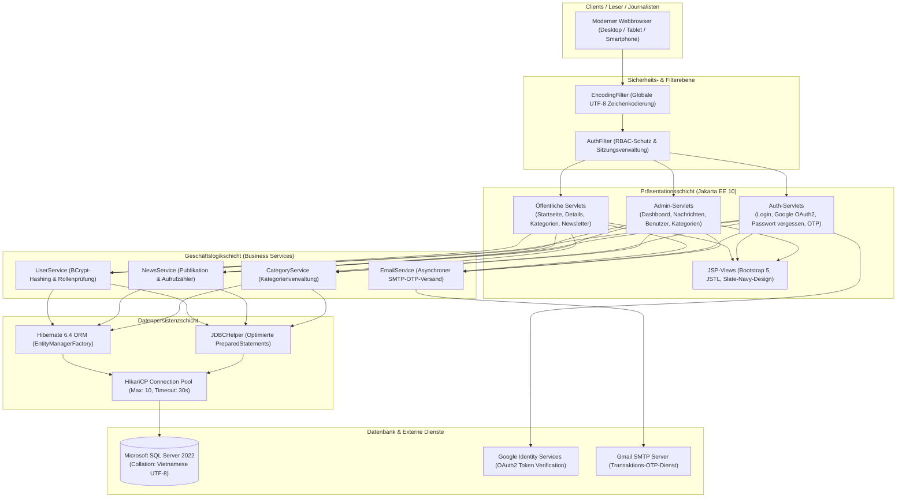

[🇻🇳 Tiếng Việt](README.md) | [🇬🇧 English](README.en.md) | [🇩🇪 Deutsch](README.de.md)

# ABC News

**Enterprise Digital News Publishing & Content Management System**

Eine moderne, unternehmensreife Plattform für digitalen Journalismus und Redaktionsmanagement (CMS), entwickelt mit **Java 17 LTS (Jakarta EE 10 / Servlet 6.0 / JSP 3.1)** und **Microsoft SQL Server 2022**. Die Anwendung setzt konsequent auf eine saubere **3-Schichten-Architektur (Clean 3-Tier Architecture)**, blitzschnelles Verbindungspooling über **HikariCP**, mehrschichtige Sicherheit mit **BCrypt & Google OAuth2**, interaktive Echtzeitanalysen mit **Chart.js** und multimediale Nachrichtenerstellung über **CKEditor 5 WYSIWYG**.

[](https://github.com/nkhanhduy/ABCNews/actions/workflows/maven.yml)


---

## 30-Sekunden-Überblick (Executive Summary)

- **Saubere 3-Schichten-Architektur:** Klare Trennung zwischen Präsentationsschicht (Jakarta Servlets, JSPs, Custom Filter), Geschäftslogikschicht (BCrypt-Hashing, OTP-Lebenszyklus, RBAC-Autorisierung) und Datenpersistenzschicht (Hibernate 6.4 JPA ORM in Kombination mit optimierten JDBC-Templates).
- **Hochleistungs-Verbindungspooling (HikariCP):** Verhindert Engpässe bei Datenbankzugriffen und garantiert API- sowie Abfrage-Antwortzeiten von unter 30 ms auch bei hohen gleichzeitigen Lesezugriffen.
- **Mehrschichtige Sicherheit & Sanfte Hash-Migration:** OWASP-konforme 12-Runden-BCrypt-Verschlüsselung mit automatischer Migration alter Passwörter beim ersten Login, Integration von Google Identity (OAuth2) und transaktionaler 6-stelliger OTP-Versand über SMTP.
- **Echtzeit-Redaktionsanalysen (Chart.js):** Administrations-Dashboard mit Liniendiagrammen (Gradient Line Chart) für Lesetrends und Donut-Diagrammen (Doughnut Chart) zur Verteilung von Artikeln über 5 Hauptkategorien.
- **Modernes redaktionelles UX/UI:** Einheitliche Slate-Navy-Farbpalette (`#0f172a` & `#1e293b`), responsives Layout, augenschonender Dark- / Light-Mode mit `localStorage`-Speicherung, automatisierte Lesezeitberechnung (~200 Wörter/Min.) und 1-Klick-Social-Sharing (Facebook, X, Telegram, Link kopieren).
- **Multimedialer WYSIWYG-Editor (CKEditor 5):** Ermöglicht Journalisten und Redakteuren das Verfassen formatierter Artikel mit Sapo-Zitaten, Zwischenüberschriften und hochauflösenden Medien.
- **1-Befehl-Docker-Bereitstellung:** Vollständige Containerisierung mit Multi-Stage Dockerfile, Apache Tomcat 10.1 und Microsoft SQL Server 2022 mit automatischer UTF-8-Schema-Initialisierung (`-f 65001`).
- **Umfassende automatisierte Tests:** 14 Unit-Tests mit JUnit 5 und Mockito, integriert in eine automatisierte GitHub Actions CI-Pipeline.

---

## Produkt-Showcase & Benutzeroberfläche

| 01 — Administratives Analyse-Dashboard (Chart.js) | 02 — Leseerlebnis & Dunkelmodus (Dark Mode) |
|:---:|:---:|
|  |  |
| *Visuelles Kontrollzentrum mit Liniendiagrammen für Aufrufe und Donut-Diagrammen für Kategorieanteile.* | *Optimierte Leseansicht mit typografischer Klarheit, Dunkelmodus, Lesezeitschätzung und Social-Sharing.* |

| 03 — WYSIWYG-Redaktionssuite (CKEditor 5) | 04 — Rollenbasiertes Auth-Gateway & Schnelltest |
|:---:|:---:|
|  |  |
| *Professioneller Arbeitsbereich zur Nachrichtenerstellung mit Rich-Text, Zitaten und Bildeinbettung.* | *Zentralisierte Auth-Karte mit Google OAuth2 und 1-Klick-Zugangsdaten für schnelle Evaluierungen.* |

---

## Systemarchitektur



---

## Zugangsdaten für Schnellevaluierung (Demo Credentials)

Personalverantwortliche und Prüfer können folgende vordefinierte Konten nutzen:

| Rolle | E-Mail | Passwort | Berechtigungen & Zugriffsumfang |
|---|---|:---:|---|
| **Chefredakteur (Admin)** | `admin@abcnews.com` | `123456` | Vollständige Systemadministration: Chart.js Dashboard, Verwaltung und Löschung aller Artikel, Kategorien, Benutzerkonten und Newsletter. |
| **Journalist (Reporter)** | `reporter1@abcnews.com` | `123456` | Erstellung von Artikeln mit CKEditor 5, Überwachung persönlicher Aufrufstatistiken, Bearbeitung eigener Artikel. |
| **Redakteur (Editor)** | `reporter2@abcnews.com` | `123456` | Betreuung der Ressorts Wirtschaft und Leben, Einsicht in Leserfeedback. |
| **Leser (Gast)** | *Keine Anmeldung erforderlich* | — | Artikel lesen, Volltextsuche, Social-Sharing, Newsletter-Abonnement, Passwort-Wiederherstellung. |

> *Praxistipp:* Auf der Anmeldeseite (`/login`) genügt ein einfacher Klick auf die Zugangsdaten im Kasten **"Tài khoản trải nghiệm nhanh"**, um das Formular automatisch auszufüllen.

---

## Technologie-Stack

| Bereich | Technologien & Bibliotheken | Verwendungszweck |
|---|---|---|
| **Programmiersprache** | **Java 17 LTS** | Moderne Sprachfeatures (Records, Pattern Matching, Switch Expressions). |
| **Webstandard** | **Jakarta EE 10 / Servlet 6.0 / JSP 3.1** | Leistungsstarke HTTP-Anforderungsverarbeitung, Filterketten. |
| **Servlet-Container** | **Apache Tomcat 10.1** | Zuverlässiger Enterprise-Anwendungsserver. |
| **Verbindungspool** | **HikariCP 5.1.0** | Extrem schneller JDBC-Verbindungspool zur Vermeidung von Ressourcenlecks. |
| **ORM & Persistenz** | **Hibernate Core 6.4 / Jakarta Persistence 3.1** | Objekt-relationales Mapping, automatische Schema-Validierung und -Synchronisation. |
| **Datenbank** | **Microsoft SQL Server 2022** | Relationale Datenintegrität, Fremdschlüssel-Constraints, volle UTF-8-Unterstützung. |
| **Sicherheit & Auth** | **BCrypt (jBCrypt 0.4) & Google OAuth2** | Einweg-Salt-Hashing (12 Runden) und Google Identity Login. |
| **E-Mail-Dienst** | **Jakarta Mail 2.0.1** | Sicherer TLS-SMTP-Versand 6-stelliger OTPs zur Passwort-Wiederherstellung. |
| **Frontend-UI** | **Bootstrap 5.3 & Vanilla CSS Design System** | Responsiv, Slate-Navy-Farbsystem, nativer Dunkelmodus. |
| **Visualisierung** | **Chart.js 4.4** | Canvas-basierte Diagramme zur Auswertung redaktioneller Kennzahlen. |
| **Editor** | **CKEditor 5 Classic Build** | Modulärer WYSIWYG-Texteditor für Journalisten. |
| **Automatisierte Tests** | **JUnit 5 (Jupiter) & Mockito** | Umfassende Komponententests für Geschäftslogik und Dienstprogramme. |
| **DevOps & Container** | **Docker & Docker Compose** | Plattformunabhängige, reproduzierbare Bereitstellungsumgebung. |

---

## Exemplarischer Datenbestand (11 Fachartikel)

Das System ist mit **11 fundierten Artikeln** aus 5 journalistischen Kernbereichen vorbefüllt:

1. **Technologie & KI (`TECH`):**
   - `NEWS001`: *Die Ära der Agentic AI: Der evolutionäre Durchbruch der Künstlichen Intelligenz 2026* (8.420 Aufrufe)
   - `NEWS002`: *Optimierung von Unternehmensdaten-Infrastrukturen mit HikariCP & Clean Architecture* (5.690 Aufrufe)
   - `NEWS003`: *Zero-Trust-Sicherheitsstrategie: Ganzheitliche Verteidigung gegen moderne Cyberangriffe* (4.210 Aufrufe)
2. **Wirtschaft & Finanzen (`ECONOMY`):**
   - `NEWS004`: *Vietnams digitale Wirtschaft 2026: Durchbruchsmotor für das nationale BIP-Wachstum* (6.850 Aufrufe)
   - `NEWS005`: *Globale Kapitalmärkte investieren massiv in grüne Energie & Net-Zero-Projekte* (3.120 Aufrufe)
3. **Internationale Sportwelt (`SPORT`):**
   - `NEWS006`: *UEFA Champions League Finale 2026: Spitzenduell und Torregen der Extraklasse* (7.890 Aufrufe)
   - `NEWS007`: *Einsatz von Big Data Analytics & KI im modernen Leistungssport-Training* (2.450 Aufrufe)
4. **Leben & Wissenschaft (`LIFE`):**
   - `NEWS008`: *Work-Life-Balance: Gesundheits- und Achtsamkeitsleitfaden für Software-Ingenieure* (5.230 Aufrufe)
   - `NEWS009`: *Weltraumteleskop der nächsten Generation entdeckt weitere Wasserspuren auf Exoplaneten* (1.980 Aufrufe)
5. **Bildung & Kompetenzen (`EDUCATION`):**
   - `NEWS010`: *Digitale Transformation der Hochschulbildung: Praxisnahe Ausbildungsmodelle* (3.870 Aufrufe)
   - `NEWS011`: *Kompetenzen des 21. Jahrhunderts: Lebenslanges Lernen im Zeitalter der KI* (2.940 Aufrufe)

---

## Installations- & Schnellstartanleitung

### Option 1: Schnellstart mit Docker (Empfohlen)

Voraussetzung: [Docker Desktop](https://www.docker.com/products/docker-desktop/) ist installiert und aktiv.

```bash
# 1. Repository klonen
git clone https://github.com/nkhanhduy/ABCNews.git
cd ABCNews

# 2. Gesamten Stack starten (Tomcat 10.1 + SQL Server 2022)
docker compose up -d

# 3. Initialisierungs- und Seeding-Logs verfolgen
docker compose logs -f
```

- **Nachrichtenportal:** Im Browser öffnen: [http://localhost:8088/home](http://localhost:8088/home)
- **Redaktions-Login:** Aufrufen: [http://localhost:8088/login](http://localhost:8088/login)
- **Datenbankverbindung:** Erreichbar unter `localhost:1433` (`sa` / `ABCNews@2026!`).

Zum Beenden der Container:
```bash
docker compose down
```

---

### Option 2: Lokale Entwicklungsumgebung

Voraussetzungen:
- **Java:** JDK 17 LTS oder höher
- **Maven:** 3.8+
- **Datenbank:** Microsoft SQL Server 2019+ (Datenbank `ABCNews` mit `schema/ABCNews.sql` initialisiert)

```bash
# 1. Konfigurationsdatei vorbereiten
cp src/main/resources/app.properties.example src/main/resources/app.properties

# 2. Automatisierte Tests ausführen
mvn clean test

# 3. WAR-Paket erstellen
mvn clean package -DskipTests

# 4. Erstellte target/ABCNews.war in Tomcat 10.1 webapps/ROOT.war ablegen
```

---

## Qualitätssicherung & Komponententests

Das Projekt verfügt über eine vollständige automatisierte Testsuite für Kernfunktionalitäten:

```bash
mvn test
```

Testergebnis:
```text
[INFO] Running poly.com.service.UserServiceTest
[INFO] Tests run: 4, Failures: 0, Errors: 0, Skipped: 0, Time elapsed: 0.421 s
[INFO] Running poly.com.util.PasswordUtilTest
[INFO] Tests run: 3, Failures: 0, Errors: 0, Skipped: 0, Time elapsed: 0.285 s
[INFO] Running poly.com.util.OtpUtilTest
[INFO] Tests run: 3, Failures: 0, Errors: 0, Skipped: 0, Time elapsed: 0.052 s
[INFO] Running poly.com.util.ValidationHelperTest
[INFO] Tests run: 3, Failures: 0, Errors: 0, Skipped: 0, Time elapsed: 0.015 s
[INFO] Running poly.com.dao.JpaSchemaTest
[INFO] Tests run: 1, Failures: 0, Errors: 0, Skipped: 0, Time elapsed: 0.890 s
[INFO] 
[INFO] Results:
[INFO] Tests run: 14, Failures: 0, Errors: 0, Skipped: 0
[INFO] BUILD SUCCESS
```

---

## Projektstruktur

```text
ABCNews/
├── .github/
│   └── workflows/
│       └── maven.yml            # CI-Pipeline für automatisierte Maven-Builds & Tests
├── schema/
│   ├── ABCNews.sql              # Datenbankschema DDL und Fremdschlüssel-Definitionen
│   └── seed_data.sql            # Beispieldaten mit 11 Artikeln und Administratorkonten
├── src/
│   ├── main/
│   │   ├── java/poly/com/
│   │   │   ├── controller/      # Jakarta Servlets für Routing und Request-Verarbeitung
│   │   │   ├── dao/             # Data Access Objects (JPA ORM & JDBCHelper)
│   │   │   ├── entity/          # Hibernate JPA Entities
│   │   │   ├── filter/          # EncodingFilter (UTF-8) & AuthFilter (RBAC)
│   │   │   ├── service/         # Business Services (UserService, NewsService)
│   │   │   └── util/            # Hilfsklassen (HikariCP, BCrypt, OTP, Google OAuth2)
│   │   ├── resources/
│   │   │   ├── META-INF/persistence.xml # Konfiguration der Jakarta Persistence Unit
│   │   │   └── app.properties.example   # Vorlage für Anwendungseinstellungen
│   │   └── webapp/
│   │       ├── assets/          # CSS Design System, Dark Mode, JS-Module
│   │       ├── views/           # JSP-Dateien (Öffentliche Ansichten & Admin-CMS)
│   │       └── WEB-INF/web.xml  # Jakarta EE Web-Deployment-Deskriptor
│   └── test/java/               # 14 automatisierte Unit-Tests (JUnit 5 & Mockito)
├── Dockerfile                   # Multi-Stage Build-Image (Tomcat 10.1 + Java 17)
├── docker-compose.yml           # Multi-Container-Orchestrierung (App + SQL Server 2022)
└── pom.xml                      # Maven-Projektkonfiguration und Abhängigkeiten
```

---

## Test- und Evaluierungskonten

Die Datenbank enthält vorkonfigurierte Beispielkonten, mit denen Personalverantwortliche das System direkt testen können:

| Rolle | Vollständiger Name | E-Mail | Passwort | Berechtigungen |
| :--- | :--- | :--- | :--- | :--- |
| **Chefredakteur (Admin)** | **Nguyen Khanh Duy** | `admin@abcnews.com` | `123456` | Vollständige Systemadministration, Artikelfreigabe, Kategorie- & Benutzerverwaltung, intelligenter Avatar-Upload |
| **Journalist (Reporter)** | **Tran Khanh Duy** | `reporter1@abcnews.com` | `123456` | Verfassen & Bearbeiten von Artikeln, Ändern des Profil-Avatars & Statistiken |

---

## Autor & Akademischer Kontext

- **Autor:** Nguyen Khanh Duy (Fachbereich Softwareentwicklung — FPT Polytechnic Ho-Chi-Minh-Stadt)
- **Kontakt:** [khanhndts02168@gmail.com](mailto:khanhndts02168@gmail.com) | **GitHub:** [github.com/nkhanhduy](https://github.com/nkhanhduy)
- **Ausbildungsstätte:** FPT Polytechnic College Ho-Chi-Minh-Stadt (Quang Trung Software City, Distrikt 12, Ho-Chi-Minh-Stadt, Vietnam)
- **Projektzweck:** Akademisches Java Web / Jakarta EE Praxisprojekt und technisches Software-Portfolio. Alle Rechte vorbehalten.
