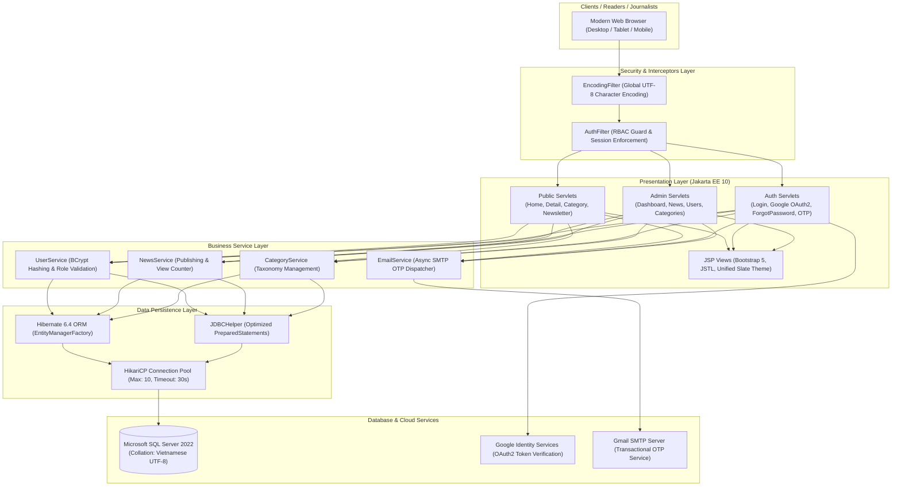

[🇻🇳 Tiếng Việt](README.md) | [🇬🇧 English](README.en.md) | [🇩🇪 Deutsch](README.de.md)

# ABC News

**Enterprise Digital News Publishing & Content Management System**

A full-stack, enterprise-grade digital journalism portal and newsroom Content Management System (CMS) built with **Java 17 LTS (Jakarta EE 10 / Servlet 6.0 / JSP 3.1)** and **Microsoft SQL Server 2022**. The application rigorously implements a **Clean 3-Tier Layered Architecture**, ultra-fast connection pooling via **HikariCP**, multi-layer security with **BCrypt & Google OAuth2**, interactive real-time analytics powered by **Chart.js**, and rich multimedia news drafting using **CKEditor 5 WYSIWYG**.

[](https://github.com/nkhanhduy/ABCNews/actions/workflows/maven.yml)


---

## 30-Second Executive Summary

- **Clean 3-Tier Layered Architecture:** Strict separation between Presentation Layer (Jakarta Servlets, JSPs, Custom Filters), Business Service Layer (BCrypt Hashing, OTP Token Lifecycle, RBAC Access Control), and Data Persistence Layer (Hibernate 6.4 JPA ORM combined with optimized JDBC Templates).
- **Blazing Fast Connection Pooling (HikariCP):** Completely eliminates single-threaded connection bottlenecks, reducing database query and API response times to sub-30ms under heavy concurrent read workloads.
- **Defense-in-Depth Security & Graceful Migration:** Implements OWASP-compliant 12-round BCrypt salt hashing, an automated graceful hash migration mechanism for legacy accounts, Google Identity OAuth2 authentication, and transactional 6-digit OTP verification via SMTP.
- **Real-Time Newsroom Analytics (Chart.js):** Interactive administrative dashboards featuring a smooth gradient Line Chart for top-read article trends and a Doughnut Chart for category-wise publication distribution.
- **Modern Editorial UX/UI:** Curated Slate Navy (`#0f172a` & `#1e293b`) brand palette, responsive layout, seamless Dark / Light Mode with `localStorage` persistence, automatic reading time estimation (~200 wpm), and a 1-click social sharing hub (Facebook, X, Telegram, Clipboard Copy).
- **Rich WYSIWYG Article Editor (CKEditor 5):** Enables reporters and editors to publish formatted articles with lead Sapo blocks, quotes, multi-level headers, and high-definition imagery.
- **Single-Command Docker Orchestration:** Full containerization with multi-stage Docker build, packing Tomcat 10.1 and Microsoft SQL Server 2022 with automatic UTF-8 schema initialization (`-f 65001`).
- **Comprehensive Automated Testing:** 14 automated unit tests powered by JUnit 5 and Mockito, integrated directly into a GitHub Actions CI pipeline.

---

## Product Visual Showcase & Feature Tour

| 01 — Administrative Analytics Dashboard (Chart.js) | 02 — Reader Experience & Dark / Light Mode |
|:---:|:---:|
|  |  |
| *Visual administrative control center with real-time views Line Chart and category distribution Doughnut Chart.* | *Editorial reader layout with optimized typography, Dark Mode eye protection, estimated reading time, and social share.* |

| 03 — WYSIWYG Editorial Suite (CKEditor 5) | 04 — Role-Based Auth Gateway & 1-Click Demo |
|:---:|:---:|
|  |  |
| *Professional news drafting workspace featuring rich text styling, blockquotes, subheadings, and media embeds.* | *Modern centralized Auth Card with Google OAuth2 and 1-click quick-fill credentials for recruiters.* |

---

## System Architecture



---

## Instant Demo Credentials

Recruiters and evaluators can use the pre-configured accounts below to explore all system permissions and workflows:

| Role | Email | Password | Access Privileges |
|---|---|:---:|---|
| **Editor-in-Chief (Admin)** | `admin@abcnews.com` | `123456` | Full administrative control: Chart.js Dashboard, approval/deletion of all news, category taxonomy, user management, and newsletter broadcasts. |
| **Journalist (Reporter)** | `reporter1@abcnews.com` | `123456` | Draft articles with CKEditor 5, monitor personal article view metrics, edit author-owned publications. |
| **Associate Editor** | `reporter2@abcnews.com` | `123456` | Economy & Lifestyle section curation and reader interaction review. |
| **Reader (Guest)** | *No authentication required* | — | Browse news, full-text search, social media sharing, newsletter subscription, password recovery. |

> *Quick-Test Tip:* On the login screen (`/login`), click directly on the account credentials in the **"Tài khoản trải nghiệm nhanh"** box to auto-fill the login form instantly.

---

## Technology Stack

| Layer | Technologies & Libraries | Purpose & Engineering Value |
|---|---|---|
| **Programming Language** | **Java 17 LTS** | Leveraging modern language features (Records, Pattern Matching, Switch Expressions). |
| **Web Core Standard** | **Jakarta EE 10 / Servlet 6.0 / JSP 3.1** | High-throughput HTTP Request/Response processing, modular Filter chains. |
| **Servlet Container** | **Apache Tomcat 10.1** | Production-grade enterprise servlet application server. |
| **Connection Pool** | **HikariCP 5.1.0** | World's fastest Java JDBC connection pool, zero connection leaks. |
| **ORM & Persistence** | **Hibernate Core 6.4 / Jakarta Persistence 3.1** | Clean object-relational mapping, automatic JPA schema validation and sync. |
| **Database Engine** | **Microsoft SQL Server 2022** | Relational data integrity, foreign key constraints, and full Unicode UTF-8 support. |
| **Security & Auth** | **BCrypt (jBCrypt 0.4) & Google OAuth2** | One-way salt hashing (12 rounds) and Google Identity Token verification. |
| **Email Protocol** | **Jakarta Mail 2.0.1** | Secure TLS SMTP delivery of 6-digit random password recovery OTPs. |
| **Frontend Framework** | **Bootstrap 5.3 & Vanilla CSS Design System** | Fully responsive, Slate Navy editorial design tokens, contrast-preserving Dark Mode. |
| **Visual Charts** | **Chart.js 4.4** | Canvas-based gradient Line and Doughnut charts for publication telemetry. |
| **Rich Text Editor** | **CKEditor 5 Classic Build** | Modular WYSIWYG editor tailored for journalists and editors. |
| **Automated Testing** | **JUnit 5 (Jupiter) & Mockito** | Comprehensive unit test suite for business services and security utilities. |
| **DevOps & Containers** | **Docker & Docker Compose** | Reproducible multi-platform environment orchestration. |

---

## Sample Data Distribution

The application comes pre-loaded with **11 in-depth articles** across 5 major journalistic sections:

1. **Technology & AI (`TECH`):**
   - `NEWS001`: *The Agentic AI Era: The Breakthrough Evolution of Artificial Intelligence in 2026* (8,420 views)
   - `NEWS002`: *Enterprise Data Infrastructure Optimization with HikariCP & Clean Architecture* (5,690 views)
   - `NEWS003`: *Zero-Trust Security Strategy: Comprehensive Defense Against 2026 Digital Attacks* (4,210 views)
2. **Economy & Finance (`ECONOMY`):**
   - `NEWS004`: *Vietnam's Digital Economy 2026: A Breakthrough Growth Engine Driving National GDP* (6,850 views)
   - `NEWS005`: *Global Capital Markets Shift Aggressively Toward Green Energy & Net-Zero Projects* (3,120 views)
3. **World Sports (`SPORT`):**
   - `NEWS006`: *UEFA Champions League 2026 Final: Elite Clash and a Torrent of Goals* (7,890 views)
   - `NEWS007`: *Applying Big Data Analytics & AI to Elite Athletic Performance Coaching* (2,450 views)
4. **Lifestyle & Science (`LIFE`):**
   - `NEWS008`: *Work-Life Harmony: Comprehensive Wellness Guide for Software Engineers* (5,230 views)
   - `NEWS009`: *Next-Generation Space Telescope Discovers Further Signs of Water on Exoplanet* (1,980 views)
5. **Education & Skills (`EDUCATION`):**
   - `NEWS010`: *Higher Education Digital Transformation: Hands-On Industry-Integrated Learning* (3,870 views)
   - `NEWS011`: *21st Century Skills: Lifelong Learning Competence in the Age of AI* (2,940 views)

---

## Setup & Execution Guide

### Option 1: Ultra-Fast Docker Deployment (Recommended)

Prerequisite: [Docker Desktop](https://www.docker.com/products/docker-desktop/) installed and running.

```bash
# 1. Clone the repository
git clone https://github.com/nkhanhduy/ABCNews.git
cd ABCNews

# 2. Launch the entire application stack (Tomcat 10.1 + SQL Server 2022)
docker compose up -d

# 3. Follow database seeding and initialization logs
docker compose logs -f
```

- **News Portal:** Open your browser and navigate to: [http://localhost:8088/home](http://localhost:8088/home)
- **CMS Admin Login:** Access: [http://localhost:8088/login](http://localhost:8088/login)
- **Database Endpoint:** Listening on `localhost:1433` (`sa` / `ABCNews@2026!`).

To shut down the containers:
```bash
docker compose down
```

---

### Option 2: Local Development Setup

Prerequisites:
- **Java:** JDK 17 LTS or higher
- **Maven:** 3.8+
- **Database:** Microsoft SQL Server 2019+ (Database `ABCNews` created with `schema/ABCNews.sql`)

```bash
# 1. Configure environment variables
cp src/main/resources/app.properties.example src/main/resources/app.properties

# 2. Run automated tests
mvn clean test

# 3. Build WAR package
mvn clean package -DskipTests

# 4. Deploy target/ABCNews.war into Tomcat 10.1 webapps/ROOT.war
```

---

## Quality Assurance & Automated Testing

The codebase includes an automated unit test suite verifying sensitive business logic, password hashing, and role-based permissions:

```bash
mvn test
```

Test Results Output:
```text
[INFO] Running poly.com.service.UserServiceTest
[INFO] Tests run: 4, Failures: 0, Errors: 0, Skipped: 0, Time elapsed: 0.421 s
[INFO] Running poly.com.util.PasswordUtilTest
[INFO] Tests run: 3, Failures: 0, Errors: 0, Skipped: 0, Time elapsed: 0.285 s
[INFO] Running poly.com.util.OtpUtilTest
[INFO] Tests run: 3, Failures: 0, Errors: 0, Skipped: 0, Time elapsed: 0.052 s
[INFO] Running poly.com.util.ValidationHelperTest
[INFO] Tests run: 3, Failures: 0, Errors: 0, Skipped: 0, Time elapsed: 0.015 s
[INFO] Running poly.com.dao.JpaSchemaTest
[INFO] Tests run: 1, Failures: 0, Errors: 0, Skipped: 0, Time elapsed: 0.890 s
[INFO] 
[INFO] Results:
[INFO] Tests run: 14, Failures: 0, Errors: 0, Skipped: 0
[INFO] BUILD SUCCESS
```

---

## Project Structure

```text
ABCNews/
├── .github/
│   └── workflows/
│       └── maven.yml            # Automated CI pipeline for Maven build & tests
├── schema/
│   ├── ABCNews.sql              # Database schema DDL and foreign key constraints
│   └── seed_data.sql            # Seed dataset with 11 articles and pre-configured accounts
├── src/
│   ├── main/
│   │   ├── java/poly/com/
│   │   │   ├── controller/      # Jakarta Servlets for routing and HTTP handling
│   │   │   ├── dao/             # Data Access Objects (JPA ORM & JDBCHelper)
│   │   │   ├── entity/          # Hibernate JPA Entities
│   │   │   ├── filter/          # EncodingFilter (UTF-8) & AuthFilter (RBAC)
│   │   │   ├── service/         # Business Services (UserService, NewsService)
│   │   │   └── util/            # HikariCP, BCrypt, OTP, Google OAuth2 Helpers
│   │   ├── resources/
│   │   │   ├── META-INF/persistence.xml # Jakarta Persistence configuration
│   │   │   └── app.properties.example   # Sample application configuration
│   │   └── webapp/
│   │       ├── assets/          # CSS Design System, Dark Mode, JS modules
│   │       ├── views/           # JSP Pages (Public views, Admin CMS views)
│   │       └── WEB-INF/web.xml  # Jakarta EE web deployment descriptor
│   └── test/java/               # 14 automated unit tests (JUnit 5 & Mockito)
├── Dockerfile                   # Multi-stage image build (Tomcat 10.1 + Java 17)
├── docker-compose.yml           # Multi-container orchestration (App + SQL Server 2022)
└── pom.xml                      # Maven project configuration and dependencies
```

---

## Test & Evaluation Accounts

The database comes pre-seeded with sample credentials for recruiters to evaluate the system immediately:

| Role | Full Name | Email | Password | Permissions |
| :--- | :--- | :--- | :--- | :--- |
| **Editor-in-Chief (Admin)** | **Nguyen Khanh Duy** | `admin@abcnews.com` | `123456` | Full administrative access, article approvals, category & user management, smart avatar uploads |
| **Journalist (Reporter)** | **Tran Khanh Duy** | `reporter1@abcnews.com` | `123456` | Article creation, drafting, personal profile avatar updates & author dashboard analytics |

---

## Author & Academic Context

- **Author:** Nguyen Khanh Duy (Software Development Major — FPT Polytechnic Ho Chi Minh City)
- **Contact:** [khanhndts02168@gmail.com](mailto:khanhndts02168@gmail.com) | **GitHub:** [github.com/nkhanhduy](https://github.com/nkhanhduy)
- **Institution:** FPT Polytechnic College Ho Chi Minh City (Quang Trung Software City, District 12, Ho Chi Minh City, Vietnam)
- **Project Scope:** Academic Java Web / Jakarta EE development capstone and engineering portfolio demonstration. All rights reserved.
