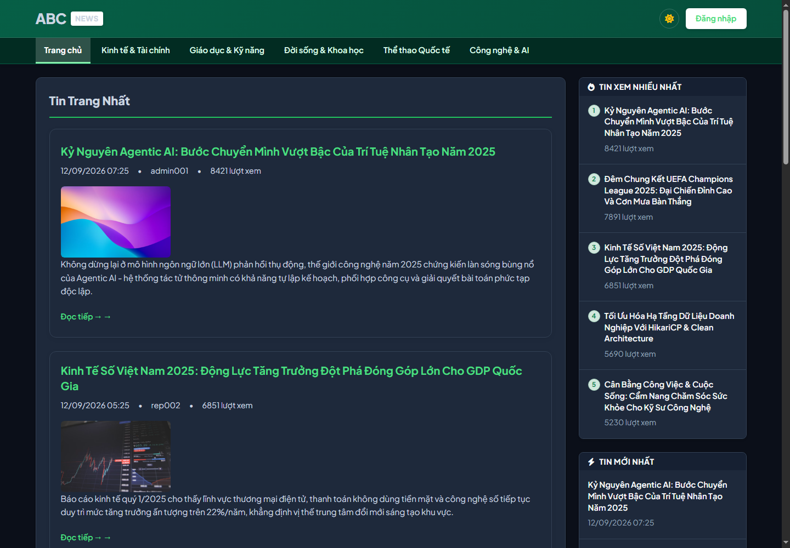
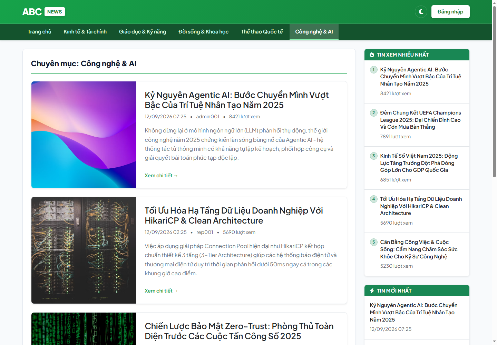
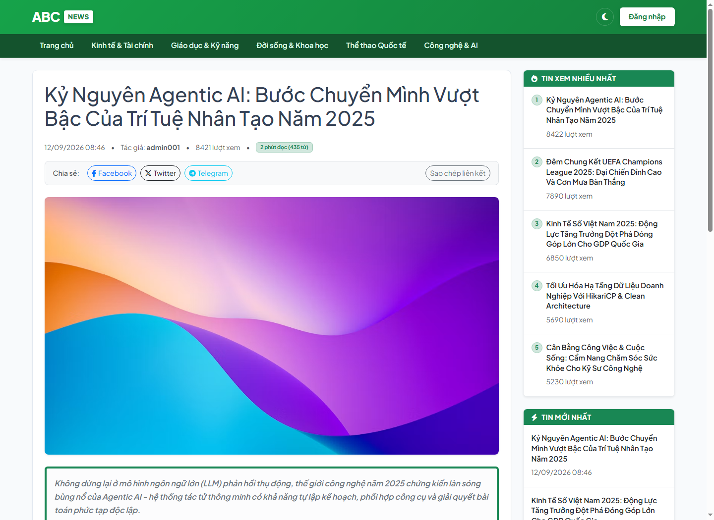
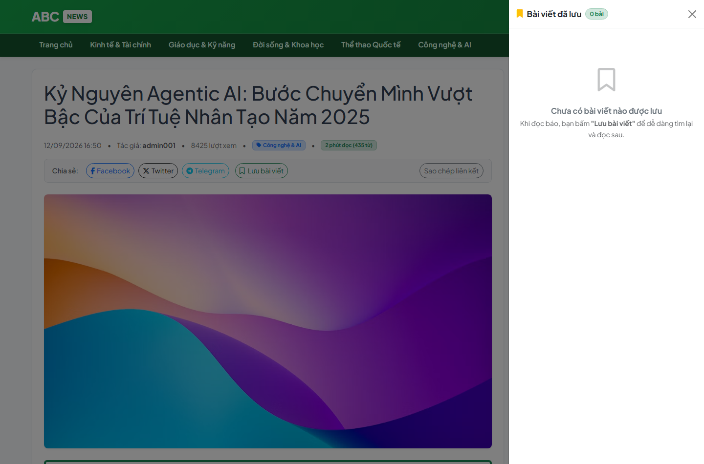
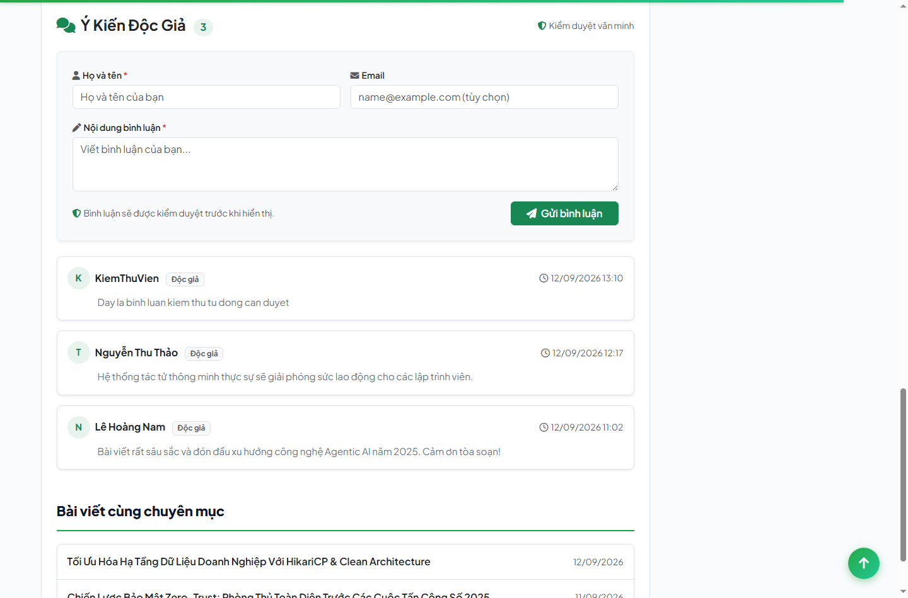
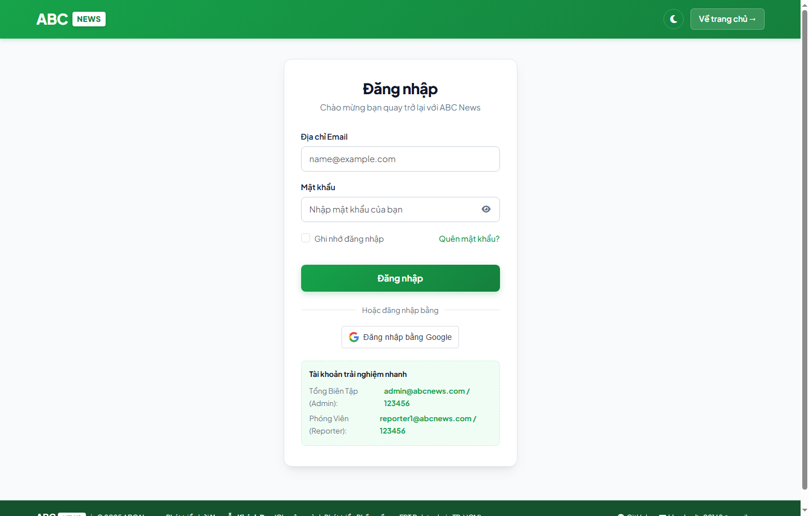
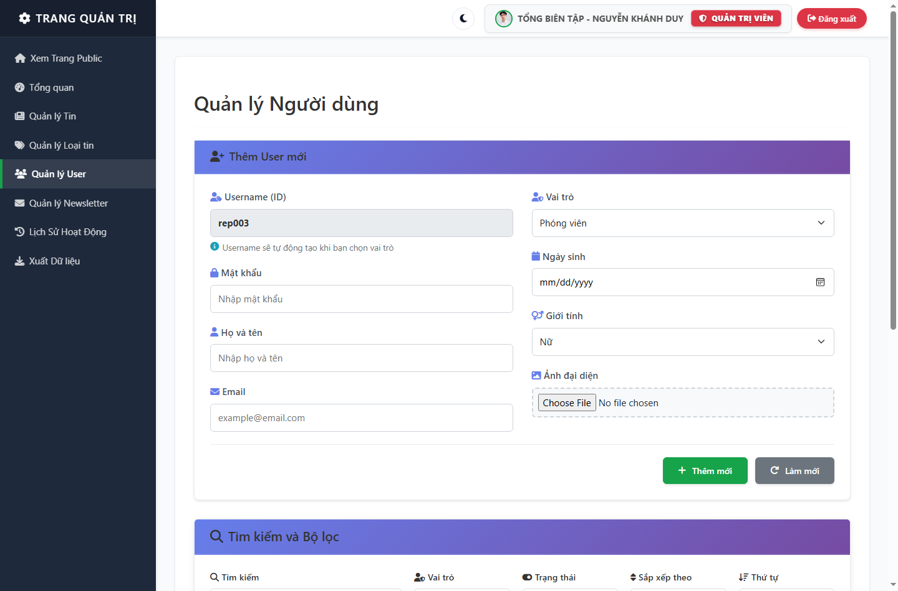
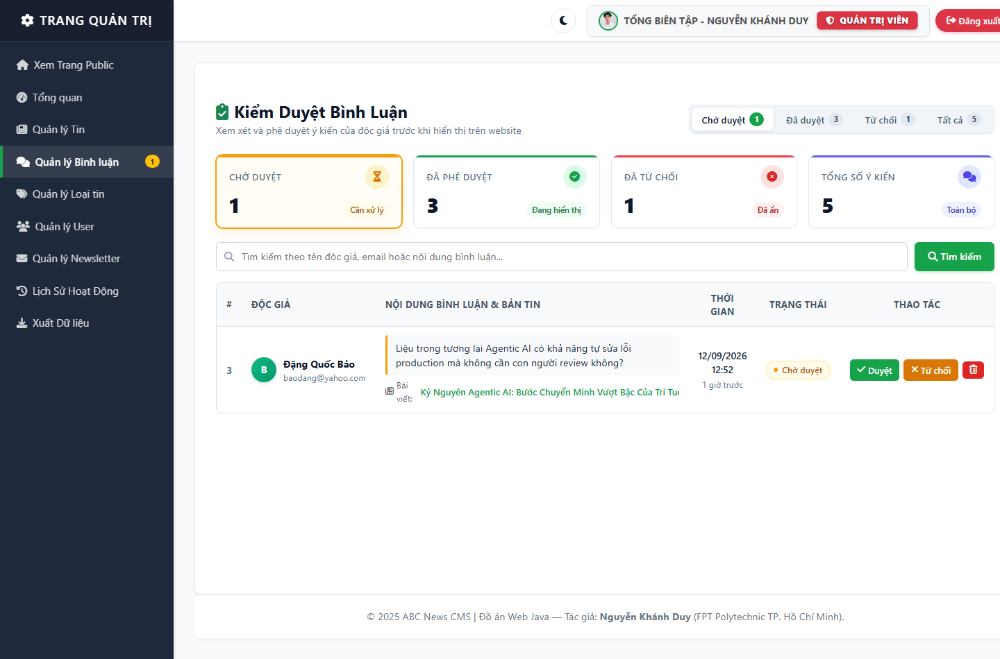
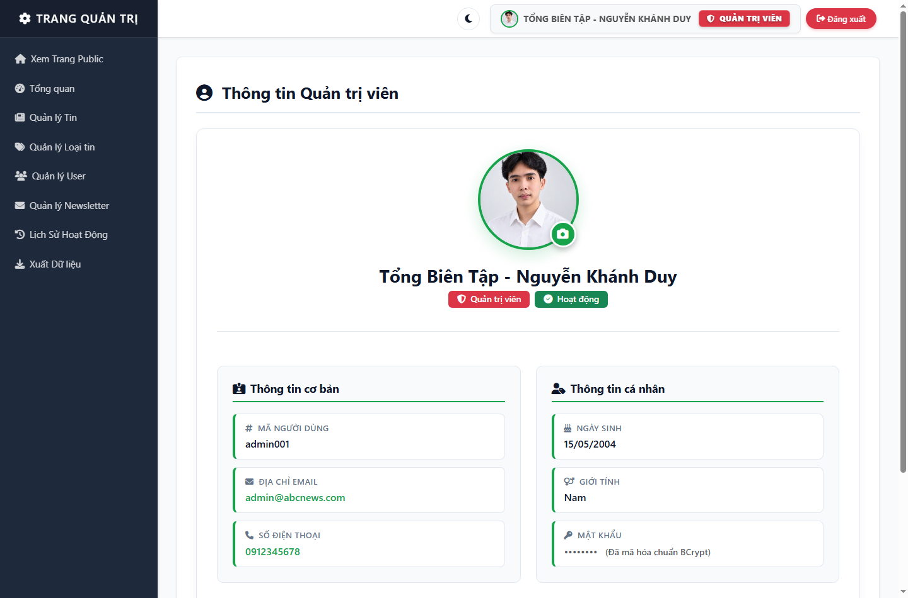

[🇻🇳 Tiếng Việt](README.md) | [🇬🇧 English](README.en.md) | [🇩🇪 Deutsch](README.de.md)

# ABCNews — News Website & Content Management

<p align="left">
  <a href="https://github.com/nkhanhduy/ABCNews/actions/workflows/maven.yml"></a>
  
  
  
  
  
  
  <a href="LICENSE"></a>
</p>

## About the Project

ABCNews is a personal learning project I developed while studying Software Development at FPT Polytechnic College, with the goal of practicing Java web development and backend fundamentals. The system provides an online news portal for readers and an editorial administration area with role-based authorization, authentication, and secure data storage mechanisms.

---

## Core Technologies

`Java 17` · `Jakarta EE 10` · `Servlet` · `JSP` · `SQL Server 2022` · `JDBC` · `HikariCP` · `Maven`

| Component | Technology and Library | Technical Notes |
|---|---|---|
| Platform and Language | Java 17 LTS, Jakarta EE 10 | Servlet 6.0, JSP 3.1, JSTL 3.0 |
| Primary Data Access | JDBC with HikariCP 5.1 | Data access through PreparedStatement and Connection Pool |
| Entity Mapping Support | Hibernate ORM 6.4 | Entity definition and schema validation support |
| Application Server | Apache Tomcat 10.1 | Servlet and JSP lifecycle container |
| Database | Microsoft SQL Server 2022 | Relational data storage with versioned migrations |
| Authentication and Hashing | BCrypt, SecureRandom, Google API Client | Password hashing, 256-bit Remember-Me token, Google ID token verification |
| Web Security | CsrfFilter, Jsoup 1.17.2, SafeImageStorage | CSRF checks on POST, HTML sanitization, and upload validation |
| Automated Testing | JUnit 5, Mockito | 82 automated tests covering core business and security flows |
| Build and CI | Apache Maven, GitHub Actions | WAR packaging and automated test execution on push or pull request |
| Runtime Environment | Docker, Docker Compose | Containerized local setup with Tomcat and SQL Server |

---

## Key Features

### Reader Features
- Read news on the homepage featuring spotlight stories, latest articles, and most-read posts.
- Browse categories via search engine friendly URLs formatted as `/category/{slug}`.
- View article details with author metadata, publish date, view counter, and estimated reading time.
- Save articles for later reading directly in browser localStorage.
- Submit comments on articles with pending moderation status.
- Switch between light and dark themes directly from the navigation bar.
- Subscribe to email newsletter updates.

### Authentication and Security
- Local authentication with BCrypt password hashing.
- Google Sign-In with server-side ID token verification.
- Change Password: Signed-in users can change their password after verifying their current password. Existing Remember Me tokens are revoked after the password is changed.
- Password reset using a 6-digit OTP sent via Gmail SMTP with a 5-minute validity window and a 3-attempt limit.
- Persistent Remember-Me login using cryptographically random 256-bit tokens, SHA-256 database hashing, and token rotation on successful auto-login.
- Account active status verified during authentication and in the access filter.

### Role-Based Authorization
- System operations are restricted using Reporter, Admin, and Super Admin roles.
- AuthFilter checks authentication for all `/admin/*` routes.
- Granular authorization rules are enforced on the server side in Controllers, Services, and SecurityHelper.
- Reporters can only edit or delete articles where they are the recorded author.
- Admins manage all articles, categories, and comment moderation.
- Super Admin status is determined by the IsSuperAdmin field in the database, allowing management of other admin accounts while preventing self-deletion and self-locking.
- User Management: Admins can update account information, assign roles, change account status, and reset passwords for accounts they are authorized to manage.

### Editorial Management
- Dashboard providing metrics for articles, accounts, categories, pending comments, and Chart.js telemetry charts.
- Article management with rich text editing, category filters, and featured story pinning.
- Auto-save drafts to browser localStorage every 30 seconds to minimize data loss from accidental tab closure.
- Comment moderation hub supporting three states: Pending, Approved, and Rejected.
- Personal profile management and avatar upload through the SafeImageStorage utility.

### Categories and Slug Routing
- Automatic conversion of Vietnamese accented titles into clean URL slugs, such as `Công nghệ & AI` into `cong-nghe-ai`.
- Duplicate resolution by appending numeric suffixes while keeping total slug length within 200 characters.
- Backward compatibility redirection from legacy `/category?id=...` links to new slug endpoints.
- Database relationship between news and categories retains the CategoryId foreign key for referential integrity.
- Article detail pages currently use `/detail?id={uuid}` as slugs are not yet applied to articles.

### Reporting and Data Export
- Data export to Excel via Apache POI, CSV, and PDF via iText7.
- Centralized newsletter subscriber email management.

---

## Screenshots

### Reader Interface

#### Homepage Light and Dark Themes
| Light Theme | Dark Theme |
|:---:|:---:|
|  |  |

#### Category View and Article Detail
| Category by Slug | Article Detail and Social Sharing |
|:---:|:---:|
|  |  |

#### Bookmarks Drawer and Reader Comments
| Offcanvas Read Later Drawer | Reader Comments Section |
|:---:|:---:|
|  |  |

### Administration Area

#### Sign-In Portal and Dashboard
| System Login Page | Editorial Dashboard |
|:---:|:---:|
|  |  |

#### Article and User Management
| Article Management and Editor | User Accounts and Roles |
|:---:|:---:|
|  |  |

#### Comment Moderation and User Profile
| Comment Moderation Hub | Author Profile and Avatar Upload |
|:---:|:---:|
|  |  |

---

## System Architecture

```
[ Web Browser Client ]
           │
           ▼
[ Servlet Filters: EncodingFilter, AuthFilter, CsrfFilter ]
           │
           ▼
[ Controller and Servlet Layer ]
           │
           ▼
[ Service Layer: Business Logic and Validation ]
           │
           ▼
[ Data Access Object - DAO ]
           │
           ▼
[ JDBCHelper and Connection Pool HikariCP ]
           │
           ▼
[ Microsoft SQL Server 2022 ]
```

The project follows a Layered MVC architecture with a Service layer for core business logic; some simple read and look-up operations may still access DAO components directly:
- Controller Layer: Receives HTTP requests, validates incoming parameters, manages session state, and forwards data to JSP views.
- Service Layer: Handles core business rules including authentication, OTP verification, Remember-Me token issuance and rotation, slug generation, and content ownership verification.
- DAO Layer: Encapsulates SQL queries and interacts with the database via PreparedStatement to minimize SQL injection risks.
- Data Access: JDBC with HikariCP is the primary data-access mechanism. Hibernate ORM serves as a supporting component for Entity definitions and schema validation.

---

## Security Mechanisms

Protection measures in the project are implemented following basic defensive principles:
- Password Hashing: User passwords are stored using one-way BCrypt hashing before database persistence.
- Password Update: The current password is verified before updating; new passwords are stored as BCrypt hashes.
- Remember-Me Token Security: Random 256-bit tokens are generated using SecureRandom. The database stores only the SHA-256 hash of the token. Browser cookies are configured with HttpOnly and SameSite=Lax flags. Token rotation is applied after successful automatic login to reduce replay risk.
- Email OTP: Six-digit OTP codes expire after 5 minutes. Verification uses the constant-time comparison algorithm MessageDigest.isEqual to mitigate timing attacks, combined with a maximum threshold of 3 failed attempts.
- Role-Based Authorization: Super Admin status is determined by the IsSuperAdmin field in the database. Regular administrators cannot modify, lock, or delete other administrator accounts.
- CSRF Protection on POST: State-changing operations in the administrative area are protected by CsrfFilter, validating tokens sent via the `_csrf` form field or `X-CSRF-TOKEN` header.
- HTML Sanitization: Jsoup with a relaxed safelist cleans news content and public comments prior to storage or rendering.
- File Upload Validation: SafeImageStorage verifies file extensions, MIME types, and assigns random UUID filenames before saving into partitioned directories.
- Server Logging: Uses java.util.logging.Logger to record exceptions and errors on the server.

---

## Category Slug and URL Routing

The system provides user-friendly category routing for readers:
- Slug Generation: Accented Vietnamese titles are converted to lowercase hyphenated strings, such as `Công nghệ & AI` to `cong-nghe-ai`, accessible at `/category/cong-nghe-ai`.
- Character Normalization: Diacritics are removed, characters đ and Đ are normalized to d, and special characters are replaced with hyphens.
- Length Constraints: The final slug string is guaranteed not to exceed 200 characters, even after appending duplicate numeric suffixes.
- Backward Compatibility: Legacy URLs formatted as `/category?id=TECH` automatically redirect to the corresponding slug route.
- Database Relations: News articles and categories remain linked through the CategoryId foreign key for referential integrity.
- Article URLs: Article detail views currently use `/detail?id={uuid}` because slugs have not yet been implemented for articles.

---

## Database

- Database Management System: Microsoft SQL Server 2022
- Connection Mechanism: JDBC with HikariCP Connection Pool
- Primary Tables:
  - `Users`: User accounts, roles, active status, and IsSuperAdmin flag.
  - `Categories`: News categories with Id, Name, and unique Slug.
  - `News`: Article content, title, summary, author, category, views, and spotlight status.
  - `Comments`: Reader feedback with Pending, Approved, or Rejected status.
  - `OtpTokens`: OTP verification codes, expiration, attempt counter, and consumed state.
  - `RememberTokens`: SHA-256 hashes of persistent login tokens and expiration dates.
  - `ActivityLogs`: System audit log recording important business actions.
  - `Newsletters`: Reader email subscriptions.
- Database Scripts:
  - `schema/ABCNews.sql`: Database creation and core table schemas.
  - `schema/seed_data.sql`: Initial seed data with UTF-8 Vietnamese support.
  - `schema/migrations/001_security_refactor.sql`: Migration adding IsSuperAdmin and RememberTokens table.
  - `schema/migrations/002_category_slug.sql`: Migration adding Slug column and unique index for categories.

---

## Configuration

The system loads configuration values through ConfigHelper following this precedence order:
1. Operating System Environment Variables
2. System Properties
3. Configuration file `src/main/resources/app.properties`
4. Local development defaults

Reference configuration template from `src/main/resources/app.properties.example`:

```properties
# Microsoft SQL Server Database
db.host=localhost
db.port=1433
db.name=ABCNews
db.user=sa
db.password=your_database_password_here

# Gmail SMTP for OTP and Newsletter
mail.smtp.host=smtp.gmail.com
mail.smtp.port=587
mail.smtp.auth=true
mail.smtp.starttls.enable=true
mail.smtp.user=your_email@gmail.com
mail.smtp.password=your_gmail_app_password_here

# Google Identity Services
google.client.id=your_google_client_id_here

# Application Base URL for Canonical and Open Graph Links
app.base.url=http://localhost:8088
```

---

## Getting Started

### Run with Docker Compose

Prerequisites: Docker Desktop installed.

```bash
# 1. Clone repository
git clone https://github.com/nkhanhduy/ABCNews.git
cd ABCNews

# 2. Start all services including Tomcat and SQL Server 2022
docker compose up -d

# 3. Check container status
docker compose ps

# 4. Open in browser:
# - Reader homepage: http://localhost:8088/home
# - Login page:      http://localhost:8088/login
```

To stop containers:
```bash
docker compose down
```

### Local Development

Prerequisites: JDK 17, Maven 3.8 or higher, Microsoft SQL Server 2019 or higher, and Apache Tomcat 10.1.

Setup steps:
1. Create the `ABCNews` database in SQL Server and execute the following scripts in order:
   - `schema/ABCNews.sql`
   - `schema/seed_data.sql`
   - `schema/migrations/001_security_refactor.sql`
   - `schema/migrations/002_category_slug.sql`
2. Create `src/main/resources/app.properties` from the example template and update database connection credentials.
3. Run automated tests and package the WAR archive:
   ```bash
   mvn clean test
   mvn clean package -DskipTests
   ```
4. Copy `target/ABCNews.war` into the `webapps` directory of Apache Tomcat 10.1 and start the server.

---

## Automated Testing

The project uses JUnit 5 and Mockito to verify business logic and security implementations:
- Authentication and Remember-Me: Tests covering successful login, failed attempts, disabled accounts, token issuance, and token rotation.
- Email OTP Flow: Tests verifying valid codes, incorrect codes, threshold lockouts, expired tokens, and single-use enforcement.
- Authorization: Tests verifying reporter article isolation, regular admin restrictions on Super Admin accounts, and self-deletion prevention.
- CSRF Filter: Tests verifying token generation on GET, HTTP 403 rejections on missing or invalid tokens on POST, form and header token validation, and exemption for Google callbacks.
- Categories and Slugs: Tests verifying Vietnamese character normalization, collision handling, and maximum length restrictions.

Command to run all tests:
```bash
mvn clean test
```

Verified test result from current source: **82/82 tests passed** with 0 failures, 0 errors, and 0 skipped.

---

## Continuous Integration

The project has an automated Continuous Integration workflow configured with GitHub Actions at `.github/workflows/maven.yml`:
- Triggers on push or pull request events to the main branch.
- Sets up an Ubuntu environment with Eclipse Temurin JDK 17 and Maven dependency caching.
- Executes `mvn -B clean test --file pom.xml` to ensure all tests pass before code integration.

---

## Demo Accounts

Pre-configured demo accounts from `schema/seed_data.sql` are available for evaluation:

| Role | Login Email | Default Password | Access Scope |
|---|---|:---:|---|
| Super Admin | `superadmin@abcnews.com` | `123456` | Full system access, administrator management, and role assignment |
| Admin | `admin@abcnews.com` | `123456` | Article management, categories, comment moderation, and reporter accounts |
| Reporter | `reporter1@abcnews.com` | `123456` | Authoring and management of own published articles |

Note: Default passwords are automatically hashed with BCrypt upon the first successful login.

---

## What I Practiced

Through developing this personal project, I practiced several key concepts:
- Handling the request lifecycle of Jakarta Servlets and Filters.
- Structuring code with the Layered MVC pattern and separating business logic into a dedicated Service layer.
- Managing relational database operations with JDBC and connection pooling via HikariCP on Microsoft SQL Server.
- Implementing fundamental web security patterns such as BCrypt password hashing, Remember-Me token rotation, constant-time OTP verification, CSRF filtering, and Jsoup HTML sanitization.
- Writing unit tests with JUnit 5 and Mockito to validate critical business flows.
- Containerizing application environments with Docker and Docker Compose.
- Setting up a basic Continuous Integration workflow with GitHub Actions.

---

## Author

- Name: Nguyen Duy Khanh
- Role: Software Development Student — FPT Polytechnic College
- GitHub: [github.com/nkhanhduy](https://github.com/nkhanhduy)
- Email: [khanhndts02168@gmail.com](mailto:khanhndts02168@gmail.com)
- Year: 2025
