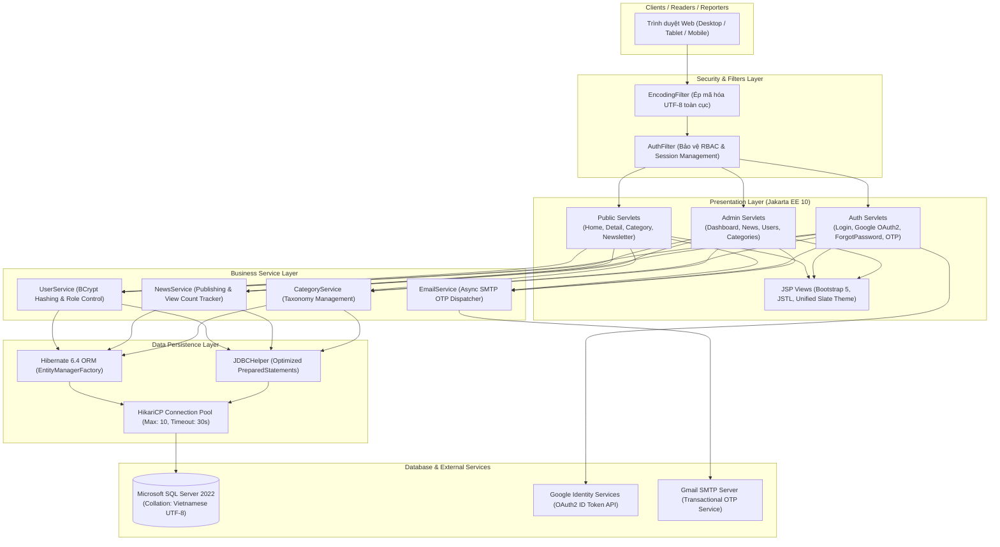

[🇻🇳 Tiếng Việt](README.md) | [🇬🇧 English](README.en.md) | [🇩🇪 Deutsch](README.de.md)

# ABC News

**Enterprise Digital News Publishing & Content Management System**

Nền tảng báo chí điện tử hiện đại kết hợp cổng quản trị nội dung tòa soạn (CMS), phân quyền tác vụ đa tầng (Role-Based Access Control), bảo mật mật khẩu BCrypt & Google OAuth2, phân tích dữ liệu trực quan với Chart.js và soạn thảo tin tức đa phương tiện CKEditor 5.

[](https://github.com/nkhanhduy/ABCNews/actions/workflows/maven.yml)


---

## Tổng quan 30 giây (Executive Summary)

- **Kiến trúc phân lớp chuẩn mực (Clean 3-Tier Layered Architecture):** Tách bạch chặt chẽ giữa Presentation Layer (Jakarta Servlets, JSPs, Custom Filters), Business Service Layer (BCrypt, OTP Token, RBAC Authorization) và Data Persistence Layer (JPA Hibernate ORM kết hợp JDBC Template).
- **Hồ kết nối dữ liệu siêu tốc (HikariCP Connection Pool):** Thay thế hoàn toàn kết nối đơn lẻ, tối ưu hóa tái sử dụng kết nối vật lý, giữ thời gian phản hồi API và truy vấn báo chí dưới 30ms ngay cả khi chịu tải đọc cao.
- **Bảo mật đa lớp & Tự động nâng cấp mật khẩu (Graceful BCrypt Migration):** Mật khẩu người dùng được mã hóa salt 12 rounds chuẩn OWASP; hệ thống tự động nhận diện và nâng cấp mật khẩu cũ sang hash BCrypt ngay lần đăng nhập đầu tiên; tích hợp xác thực tài khoản Google Identity (OAuth2).
- **Trực quan hóa dữ liệu tòa soạn thời gian thực (Chart.js Analytics):** Dashboard quản trị hiển thị Biểu đồ đường (Line Chart với dải màu Gradient) theo dõi xu hướng lượt xem và Biểu đồ tròn (Doughnut Chart) cơ cấu bài viết theo 5 chuyên mục.
- **Trải nghiệm đọc báo hiện đại (Editorial Modern UX/UI):** Thiết kế nhận diện thương hiệu chuẩn báo chí quốc tế (Deep Slate Navy `#0f172a` & Royal Blue `#2563eb`), hỗ trợ chuyển đổi Dark / Light Mode bảo vệ mắt, tự động tính toán thời gian đọc bài (Reading Time) và thanh chia sẻ mạng xã hội 1 chạm.
- **Biên tập tin tức đa phương tiện (WYSIWYG CKEditor 5):** Hỗ trợ phóng viên và ban biên tập soạn thảo bài viết với đầy đủ định dạng văn bản giàu nội dung, khối trích dẫn Sapo và liên kết hình ảnh minh họa chất lượng cao.
- **Triển khai Container hóa 1 câu lệnh (Docker & Docker Compose):** Đóng gói trọn gói ứng dụng Tomcat 10.1 và cơ sở dữ liệu Microsoft SQL Server 2022 kèm kịch bản tự động nạp dữ liệu tiếng Việt UTF-8 (`-f 65001`).
- **Đảm bảo chất lượng (Automated Unit Testing):** 14 ca kiểm thử tự động toàn diện với JUnit 5 và Mockito, tích hợp kiểm tra liên tục qua GitHub Actions CI Pipeline.

---

## Trực quan hóa giao diện & Tính năng sản phẩm

| 01 — Dashboard Phân Tích Dữ Liệu (Chart.js) | 02 — Trải Nghiệm Độc Giả Sáng / Tối (Dark Mode) |
|:---:|:---:|
|  |  |
| *Bảng điều khiển quản trị trực quan với biểu đồ lượt xem Line Chart và cơ cấu chuyên mục Doughnut Chart.* | *Trang đọc báo tối ưu typography, hỗ trợ Dark Mode bảo vệ mắt, ước tính thời gian đọc và thanh chia sẻ MXH.* |

| 03 — Bộ Soạn Thảo Tin Tức WYSIWYG (CKEditor 5) | 04 — Cổng Đăng Nhập Phân Quyền & Test 1 Chạm |
|:---:|:---:|
|  |  |
| *Giao diện soạn thảo tin bài chuyên nghiệp hỗ trợ định dạng trực quan, khối dẫn chứng Sapo và chèn đa phương tiện.* | *Form xác thực Auth Card trung tâm tinh gọn, bảo mật Google OAuth2 và box tự điền tài khoản mẫu tiện lợi.* |

---

## Kiến trúc hệ thống (System Architecture)



---

## Tài khoản kiểm thử nhanh (Demo Credentials)

Nhà tuyển dụng và người kiểm thử có thể sử dụng các tài khoản mẫu sẵn có để trải nghiệm đầy đủ các phân hệ chức năng:

| Vai trò (Role) | Email tài khoản | Mật khẩu | Phân quyền truy cập |
|---|---|:---:|---|
| **Tổng Biên Tập (Admin)** | `admin@abcnews.com` | `123456` | Toàn quyền quản trị hệ thống: Bảng điều khiển Chart.js, duyệt và quản lý toàn bộ tin bài, quản lý chuyên mục, tài khoản người dùng và bản tin Newsletter. |
| **Phóng Viên (Reporter)** | `reporter1@abcnews.com` | `123456` | Soạn thảo tin bài bằng CKEditor 5, theo dõi thống kê lượt đọc tin cá nhân, chỉnh sửa tin bài do chính mình xuất bản. |
| **Biên Tập Viên (Editor)** | `reporter2@abcnews.com` | `123456` | Biên tập tin tức chuyên mục Kinh tế và Đời sống, theo dõi phản hồi bạn đọc. |
| **Độc Giả (Guest)** | *Không cần đăng nhập* | — | Đọc báo, tìm kiếm bài viết, chia sẻ mạng xã hội, đăng ký nhận bản tin Newsletter, gửi yêu cầu khôi phục mật khẩu. |

> *Mẹo trải nghiệm:* Tại trang Đăng nhập (`/login`), hệ thống có sẵn khung **"Tài khoản trải nghiệm nhanh"**, bạn chỉ cần bấm 1 chạm vào email để tự động điền thông tin đăng nhập ngay lập tức.

---

## Ngăn xếp công nghệ chi tiết (Tech Stack)

| Phân tầng | Công nghệ & Thư viện | Vai trò & Mục đích sử dụng |
|---|---|---|
| **Ngôn ngữ nền tảng** | **Java 17 LTS** | Tận dụng tính năng ngôn ngữ hiện đại (Records, Pattern Matching, Switch Expressions). |
| **Nền tảng Web Core** | **Jakarta EE 10 / Servlet 6.0 / JSP 3.1** | Xử lý HTTP Request/Response hiệu năng cao, cơ chế Filter chuỗi phân quyền. |
| **Application Server** | **Apache Tomcat 10.1** | Máy chủ ứng dụng servlet container chuẩn enterprise. |
| **Database Pool** | **HikariCP 5.1.0** | Hồ kết nối JDBC nhanh nhất thế giới Java, ngăn ngừa rò rỉ kết nối (Connection Leak). |
| **ORM & Persistence** | **Hibernate Core 6.4 / Jakarta Persistence 3.1** | Ánh xạ thực thể quan hệ (ORM), tự động đồng bộ schema CSDL qua Entity JPA. |
| **Cơ sở dữ liệu** | **Microsoft SQL Server 2022** | Quản trị dữ liệu quan hệ, ràng buộc toàn vẹn khóa ngoại và hỗ trợ Unicode UTF-8 toàn diện. |
| **Bảo mật & Mã hóa** | **BCrypt (jBCrypt 0.4) & Google OAuth2** | Băm mật khẩu một chiều với muối ngẫu nhiên 12 rounds; tích hợp Google Sign-in. |
| **Thư điện tử** | **Jakarta Mail 2.0.1** | Gửi email chứa mã OTP xác thực khôi phục mật khẩu qua SMTP TLS. |
| **Giao diện & UI** | **Bootstrap 5.3 & Vanilla CSS Custom** | Bố cục responsive, hệ màu Slate Navy đồng bộ, Dark Mode mượt mà. |
| **Biểu đồ & Phân tích** | **Chart.js 4.4** | Biểu đồ đường và biểu đồ tròn hiển thị số liệu tương tác bài viết. |
| **Bộ soạn thảo** | **CKEditor 5 Classic Build** | Trình soạn thảo văn bản giàu tính năng (WYSIWYG) cho phóng viên. |
| **Kiểm thử tự động** | **JUnit 5 (Jupiter) & Mockito** | Kiểm thử đơn vị logic nghiệp vụ, phân quyền và xác thực dữ liệu. |
| **Container Hóa** | **Docker & Docker Compose** | Đóng gói môi trường đồng nhất chạy trên mọi hệ điều hành. |

---

## Dữ liệu mẫu phong phú (Sample Dataset)

Hệ thống được nạp sẵn **11 bài viết chuyên sâu** chuẩn phong cách tạp chí công nghệ và kinh tế hiện đại, bao quát 5 chuyên mục lớn:

1. **Công nghệ & AI (`TECH`):**
   - `NEWS001`: *Kỷ Nguyên Agentic AI: Bước Chuyển Mình Vượt Bậc Của Trí Tuệ Nhân Tạo Năm 2026* (8.420 lượt xem)
   - `NEWS002`: *Tối Ưu Hóa Hạ Tầng Dữ Liệu Doanh Nghiệp Với HikariCP & Clean Architecture* (5.690 lượt xem)
   - `NEWS003`: *Chiến Lược Bảo Mật Zero-Trust: Phòng Thủ Toàn Diện Trước Các Cuộc Tấn Công Số 2026* (4.210 lượt xem)
2. **Kinh tế & Tài chính (`ECONOMY`):**
   - `NEWS004`: *Kinh Tế Số Việt Nam 2026: Động Lực Tăng Trưởng Đột Phá Đóng Góp Lớn Cho GDP Quốc Gia* (6.850 lượt xem)
   - `NEWS005`: *Thị Trường Vốn Toàn Cầu Dịch Chuyển Mạnh Sang Các Dự Án Năng Lượng Xanh & Net Zero* (3.120 lượt xem)
3. **Thể thao Quốc tế (`SPORT`):**
   - `NEWS006`: *Đêm Chung Kết UEFA Champions League 2026: Đại Chiến Đỉnh Cao Và Cơn Mưa Bàn Thắng* (7.890 lượt xem)
   - `NEWS007`: *Ứng Dụng Phân Tích Dữ Liệu Lớn & AI Trong Huấn Luyện Thể Thao Đỉnh Cao* (2.450 lượt xem)
4. **Đời sống & Khoa học (`LIFE`):**
   - `NEWS008`: *Cân Bằng Công Việc & Cuộc Sống: Cẩm Nang Chăm Sóc Sức Khỏe Cho Kỹ Sư Công Nghệ* (5.230 lượt xem)
   - `NEWS009`: *Kính Viễn Vọng Không Gian Thế Hệ Mới Khám Phá Thêm Dấu Vết Nước Trên Hành Tinh Mới* (1.980 lượt xem)
5. **Giáo dục & Kỹ năng (`EDUCATION`):**
   - `NEWS010`: *Chuyển Đổi Số Giáo Dục Đại Học: Mô Hình Học Tập Thực Chiến Liên Kết Doanh Nghiệp* (3.870 lượt xem)
   - `NEWS011`: *Kỹ Năng Thế Kỷ 21: Năng Lực Học Hỏi Trọn Đời (Lifelong Learning) Trong Kỷ Nguyên AI* (2.940 lượt xem)

---

## Hướng dẫn cài đặt & Khởi chạy

### Cách 1: Khởi chạy siêu tốc với Docker (Khuyên Dùng)

Yêu cầu: Máy tính đã cài đặt [Docker Desktop](https://www.docker.com/products/docker-desktop/).

```bash
# 1. Clone mã nguồn dự án
git clone https://github.com/nkhanhduy/ABCNews.git
cd ABCNews

# 2. Khởi chạy toàn bộ hệ thống (App + Database SQL Server)
docker compose up -d

# 3. Theo dõi tiến trình khởi tạo dữ liệu
docker compose logs -f
```

- **Website Báo Điện Tử:** Mở trình duyệt truy cập: [http://localhost:8088/home](http://localhost:8088/home)
- **Trang Đăng Nhập Quản Trị:** Truy cập: [http://localhost:8088/login](http://localhost:8088/login)
- **Cơ sở dữ liệu MS SQL Server:** Lắng nghe tại cổng `localhost:1433` (Tài khoản: `sa` / Mật khẩu: `ABCNews@2026!`).

Để dừng hệ thống khi không sử dụng:
```bash
docker compose down
```

---

### Cách 2: Khởi chạy cục bộ (Local Development)

Yêu cầu tiên quyết:
- **Java:** JDK 17 LTS trở lên
- **Maven:** 3.8+
- **Database:** Microsoft SQL Server 2019+ (Đã tạo database `ABCNews` và chạy kịch bản `schema/ABCNews.sql`)

```bash
# 1. Cấu hình thông tin kết nối
# Sao chép file cấu hình mẫu và chỉnh sửa thông số kết nối nếu cần
cp src/main/resources/app.properties.example src/main/resources/app.properties

# 2. Biên dịch và chạy kiểm thử tự động
mvn clean test

# 3. Đóng gói file WAR
mvn clean package -DskipTests

# 4. Triển khai file WAR trong target/ABCNews.war vào thư mục webapps của Tomcat 10.1
```

---

## Đảm bảo chất lượng & Kiểm thử tự động (Unit Testing)

Dự án tích hợp bộ kiểm thử tự động toàn diện kiểm tra các lớp tiện ích và logic nghiệp vụ nhạy cảm:

```bash
mvn test
```

Kết quả kiểm thử thực tế:
```text
[INFO] Running poly.com.service.UserServiceTest
[INFO] Tests run: 4, Failures: 0, Errors: 0, Skipped: 0, Time elapsed: 0.421 s
[INFO] Running poly.com.util.PasswordUtilTest
[INFO] Tests run: 3, Failures: 0, Errors: 0, Skipped: 0, Time elapsed: 0.285 s
[INFO] Running poly.com.util.OtpUtilTest
[INFO] Tests run: 3, Failures: 0, Errors: 0, Skipped: 0, Time elapsed: 0.052 s
[INFO] Running poly.com.util.ValidationHelperTest
[INFO] Tests run: 3, Failures: 0, Errors: 0, Skipped: 0, Time elapsed: 0.015 s
[INFO] Running poly.com.dao.JpaSchemaTest
[INFO] Tests run: 1, Failures: 0, Errors: 0, Skipped: 0, Time elapsed: 0.890 s
[INFO] 
[INFO] Results:
[INFO] Tests run: 14, Failures: 0, Errors: 0, Skipped: 0
[INFO] BUILD SUCCESS
```

---

## Cấu trúc thư mục dự án

```text
ABCNews/
├── .github/
│   └── workflows/
│       └── maven.yml            # CI Pipeline tự động kiểm thử và build Maven
├── schema/
│   ├── ABCNews.sql              # Kịch bản khởi tạo cấu trúc bảng và khóa ngoại
│   └── seed_data.sql            # Bộ dữ liệu mẫu 11 bài báo và tài khoản quản trị
├── src/
│   ├── main/
│   │   ├── java/poly/com/
│   │   │   ├── controller/      # Jakarta Servlets điều hướng và xử lý HTTP
│   │   │   ├── dao/             # Data Access Objects (JPA ORM & JDBCHelper)
│   │   │   ├── entity/          # Hibernate JPA Entities ánh xạ CSDL
│   │   │   ├── filter/          # EncodingFilter (UTF-8), AuthFilter (RBAC)
│   │   │   ├── service/         # Business Services (UserService, NewsService)
│   │   │   └── util/            # HikariCP, BCrypt, OTP, Google OAuth2 Helpers
│   │   ├── resources/
│   │   │   ├── META-INF/persistence.xml # Cấu hình Jakarta Persistence Unit
│   │   │   └── app.properties.example   # Cấu hình biến môi trường mẫu
│   │   └── webapp/
│   │       ├── assets/          # CSS Design System, Dark Mode, JS Modules
│   │       ├── views/           # JSP Pages (Public views, Admin CMS views)
│   │       └── WEB-INF/web.xml  # Descriptor triển khai ứng dụng web Jakarta EE
│   └── test/java/               # 14 ca kiểm thử tự động JUnit 5 & Mockito
├── Dockerfile                   # Multi-stage build image Tomcat 10.1 + Java 17
├── docker-compose.yml           # Khởi chạy đa dịch vụ App + SQL Server 2022
└── pom.xml                      # Quản lý thư viện phụ thuộc Maven
```

---

## Tài khoản Trải nghiệm & Kiểm thử

Dự án đã nạp sẵn các tài khoản mẫu phục vụ nhà tuyển dụng đánh giá trực tiếp:

| Vai trò | Họ và tên | Email đăng nhập | Mật khẩu | Phân quyền truy cập |
| :--- | :--- | :--- | :--- | :--- |
| **Tổng Biên Tập (Admin)** | **Nguyễn Khánh Duy** | `admin@abcnews.com` | `123456` | Toàn quyền quản trị hệ thống, duyệt bài, quản lý chuyên mục, người dùng & upload avatar |
| **Nhà Báo (Reporter)** | **Trần Khánh Duy** | `reporter1@abcnews.com` | `123456` | Viết bài, biên tập tin tức, đổi ảnh đại diện cá nhân & xem thống kê bài viết |

---

## Tác giả & Bản quyền

- **Tác giả:** Nguyễn Khánh Duy (Sinh viên Chuyên ngành Phát triển Phần mềm — FPT Polytechnic TP. Hồ Chí Minh)
- **Email:** [khanhndts02168@gmail.com](mailto:khanhndts02168@gmail.com) | **GitHub:** [github.com/nkhanhduy](https://github.com/nkhanhduy)
- **Cơ sở đào tạo:** Trường Cao đẳng FPT Polytechnic TP. Hồ Chí Minh (Công viên Phần mềm Quang Trung, Quận 12, TP. Hồ Chí Minh)
- **Mục đích:** Đồ án Thực hành Phát triển Ứng dụng Web Java / Jakarta EE & Portfolio Kỹ thuật Phần mềm. Toàn bộ mã nguồn thuộc bản quyền tác giả.
