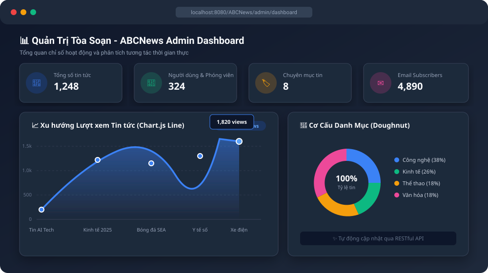
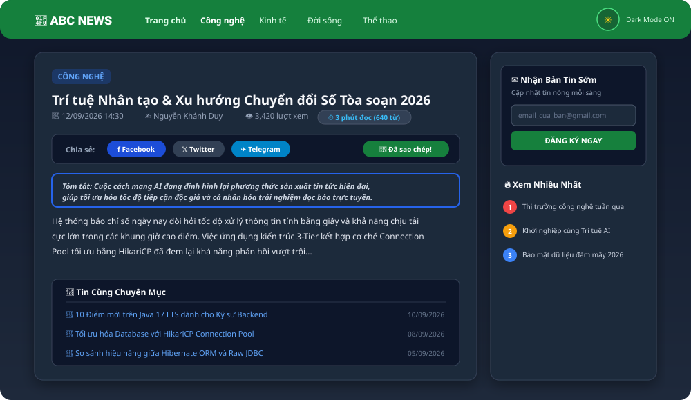
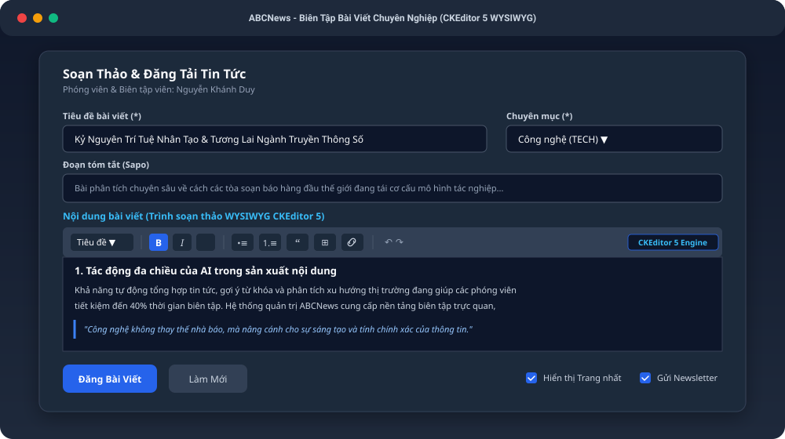
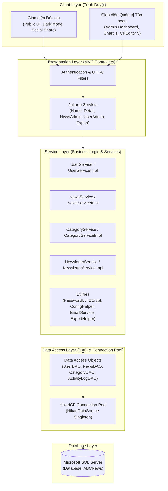

# ABCNews - Báo Điện Tử Trực Tuyến & Cổng Quản Trị Nội Dung Đa Tầng (Enterprise CMS)

[](https://github.com/nkhanhduy/ABCNews/actions/workflows/maven.yml)


> **ABCNews** là nền tảng báo điện tử và quản trị tòa soạn tin tức hoàn chỉnh được xây dựng trên nền tảng **Java Servlet/JSP (Jakarta EE 10)** kết hợp cơ sở dữ liệu **Microsoft SQL Server**. Dự án áp dụng chặt chẽ kiến trúc **3-Tier Layered Architecture**, kết nối cơ sở dữ liệu siêu tốc thông qua **HikariCP Connection Pool**, bảo mật mật khẩu đa lớp với **BCrypt & Google OAuth2**, cùng hệ thống phân tích trực quan **Chart.js** và biên tập **CKEditor 5 WYSIWYG**.

---

## Giao Diện & Trực Quan Hóa Hệ Thống (Screenshots & Demo)

### 1. Dashboard Admin Phân Tích Dữ Liệu Với Chart.js
Trực quan hóa xu hướng tương tác độc giả với Biểu đồ đường (Line Chart dải màu Gradient) và cơ cấu bài viết theo chuyên mục (Doughnut Chart):


### 2. Giao Diện Độc Giả Sáng / Tối (Dark Mode), Thời Gian Đọc & Chia Sẻ MXH
Trang chi tiết bài viết hỗ trợ chế độ Dark Mode bảo vệ mắt, hiển thị thời gian đọc ước tính và cụm nút chia sẻ 1-click lên mạng xã hội:


### 3. Bộ Soạn Thảo Tin Tức WYSIWYG Chuyên Nghiệp (CKEditor 5)
Hỗ trợ phóng viên và ban biên tập soạn thảo bài viết phong phú với thanh công cụ WYSIWYG tích hợp:


---

## Kiến Trúc Công Nghệ & Tính Năng Cốt Lõi

### 1. Kiến Trúc & Hiệu Năng (Architecture & Performance)
* **Hibernate 6 / Jakarta JPA ORM (Tự Động Sinh Bảng)**: Tích hợp Hibernate Core 6.4 với chế độ `hbm2ddl.auto = update`. Hệ thống tự động phân tích 6 Entity Java để khởi tạo và đồng bộ schema CSDL trong SQL Server ngay khi khởi động, giảm thiểu rủi ro sai lệch cấu trúc dữ liệu.
* **HikariCP Connection Pool**: Thay thế hoàn toàn kết nối đơn lẻ `DriverManager.getConnection()` bằng Connection Pool nhanh nhất thế giới Java, thiết lập ngưỡng kết nối tối ưu, tự động thu hồi và chống rò rỉ bộ nhớ (Connection Leaks).
* **Container Hóa Toàn Diện (Docker & Docker Compose)**: Cung cấp `Dockerfile` multi-stage build và `docker-compose.yml` để khởi chạy đồng bộ ứng dụng Tomcat 10 và cơ sở dữ liệu MS SQL Server 2022 chỉ bằng 1 câu lệnh duy nhất.
* **Zero Hardcoded Credentials (12-Factor App)**: Tách biệt cấu hình ứng dụng (Database, Gmail SMTP, Google OAuth) ra biến môi trường hệ thống (`System.getenv()`) và file `app.properties` được Git bảo vệ tuyệt đối.
* **Unit Testing với JUnit 5 & Mockito**: Kiểm thử tự động toàn diện các hàm logic nghiệp vụ cốt lõi: `UserServiceTest` (phân quyền RBAC, phòng chống xóa nhầm tài khoản chính mình), `PasswordUtilTest`, `OtpUtilTest`, `ValidationHelperTest` và `JpaSchemaTest` (14/14 tests passing).

### 2. Trải Nghiệm Người Dùng (Modern UX/UI & Features)
* **Dashboard Phân Tích Dữ Liệu Trực Quan (Chart.js)**: 
  * *Biểu đồ đường (Line Chart)*: Phân tích xu hướng lượt xem các bài viết hàng đầu với hiệu ứng dải màu Gradient hiện đại.
  * *Biểu đồ tròn (Doughnut Chart)*: Trực quan hóa tỷ lệ cơ cấu phân bổ bài viết theo từng danh mục tin tức.
* **Bộ Soạn Thảo Tin Tức WYSIWYG (CKEditor 5)**: Hỗ trợ phóng viên và biên tập viên soạn bài chuyên nghiệp: in đậm, nghiêng, gạch chân, tiêu đề H1-H3, danh sách, khối trích dẫn, bảng biểu và chèn ảnh minh họa.
* **Chế Độ Giao Diện Sáng / Tối (Dark / Light Mode Toggle)**: Chuyển đổi mượt mà 1-click, bảng màu tối dịu mắt (`#0f172a` Slate), tự động ghi nhớ trạng thái người dùng qua `localStorage` và xử lý chống giật màn hình (FOUC).
* **Ước Tính Thời Gian Đọc Bài Viết**: Tự động tính toán dung lượng từ ngữ bài viết theo thuật toán đọc trung bình (~200 từ/phút), hiển thị trực quan thời lượng đọc ước tính.
* **Thanh Chia Sẻ Mạng Xã Hội Nhanh (1-Click Social Share)**: Tích hợp nút chia sẻ bài viết nhanh lên Facebook, X (Twitter), Telegram và sao chép liên kết vào bộ nhớ tạm kèm hiệu ứng Toast phản hồi tức thì.

### 3. Bảo Mật & Quản Trị Tòa Soạn (Security & Administration)
* **Bảo Mật Mật Khẩu BCrypt & Graceful Auto-Migration**: Toàn bộ mật khẩu được mã hóa salt 12 rounds. Tích hợp thuật toán tự động nhận diện và nâng cấp mật khẩu cũ dạng chuỗi trần sang hash BCrypt ngay trong lần đăng nhập đầu tiên.
* **Xác Thực 2 Lớp OTP & Google OAuth2**: Tích hợp Google Identity Services (ID Token verification) và luồng Quên mật khẩu gửi mã OTP 6 số ngẫu nhiên qua Gmail SMTP.
* **Phân Quyền Chi Tiết (RBAC)**: 4 cấp bậc phân quyền rõ ràng:
  * `Guest`: Đọc báo, tìm kiếm tin tức, đăng ký bản tin Newsletter, gửi yêu cầu đặt lại mật khẩu.
  * `Reporter`: Dashboard theo dõi chỉ số tin tức cá nhân, quản lý và đăng bài viết của chính mình, xuất báo cáo tin cá nhân.
  * `Admin`: Quản lý toàn bộ tin tức, chuyên mục, tài khoản phóng viên/người dùng, hệ thống Newsletter và xuất báo cáo toàn sàn.
  * `Super Admin`: Cấp bậc tối cao, toàn quyền quản trị và phân quyền cho các tài khoản Admin khác.
* **Xuất Báo Cáo Đa Định Dạng (Export Engine)**: Xuất dữ liệu danh sách Tin tức, Người dùng, Chuyên mục ra file **Excel (.xlsx - Apache POI)** và **PDF (iText 7)** có định dạng bảng biểu, tiêu đề chuẩn mực.
* **Nhật Ký Hoạt Động (Audit Trail & Activity Logs)**: Ghi vết toàn bộ hành vi quan trọng (Đăng nhập, Đăng xuất, Thêm/Sửa/Xóa tin, Khóa/Mở khóa tài khoản) kèm địa chỉ IP và thời gian thực.

---

## Sơ Đồ Kiến Trúc Hệ Thống (Architecture Diagram)



---

## Hướng Dẫn Cài Đặt & Khởi Chạy (Quickstart Guide)

### Phương án 1: Triển khai tự động bằng Docker & Docker Compose (Khuyên dùng)
Dự án đã được cấu hình sẵn môi trường đầy đủ gồm **Apache Tomcat 10.1 (Java 17)** và **Microsoft SQL Server 2022**. Bạn chỉ cần 1 câu lệnh duy nhất:

```bash
# 1. Clone repository
git clone https://github.com/nkhanhduy/ABCNews.git
cd ABCNews

# 2. Khởi chạy toàn bộ hệ thống bằng Docker Compose
docker compose up -d
```

> Ứng dụng sẽ tự động biên dịch, khởi tạo cơ sở dữ liệu và sẵn sàng phục vụ tại: **`http://localhost:8088/home`**

---

### Phương án 2: Cài đặt và phát triển cục bộ (Local Development)

#### Bước 1: Khởi tạo Cơ sở dữ liệu SQL Server
* **Cách tự động (Hibernate JPA)**: Bạn chỉ cần tạo một database rỗng tên `ABCNews` trong SQL Server. Hibernate 6 sẽ tự động kiểm tra và sinh toàn bộ bảng (`Users`, `News`, `Categories`, `Newsletters`, `ActivityLogs`, `OtpTokens`) ngay khi ứng dụng khởi chạy (`hbm2ddl.auto = update`).
* **Cách thủ công (Full Data mẫu)**: Thực thi file script CSDL tại:
  ```sql
  schema/ABCNews.sql
  ```

#### Bước 2: Cấu hình Thông tin Kết nối
Tạo file cấu hình `src/main/resources/app.properties` (dựa trên mẫu có sẵn `app.properties.example`):
```properties
# Cấu hình Database SQL Server
db.url=jdbc:sqlserver://localhost:1433;databaseName=ABCNews;encrypt=true;trustServerCertificate=true;
db.username=sa
db.password=123456

# Cấu hình Gmail SMTP (Gửi OTP & Bản tin Newsletter)
smtp.user=your_email@gmail.com
smtp.password=your_app_password

# Cấu hình Google OAuth 2.0 (Đăng nhập Google)
google.client.id=your_google_client_id.apps.googleusercontent.com
```

#### Bước 3: Biên dịch, Chạy Unit Test & Triển khai
1. Chạy kiểm thử tự động với Maven:
   ```bash
   mvn clean test
   ```
2. Đóng gói ứng dụng thành file `.war`:
   ```bash
   mvn clean package
   ```
3. Triển khai file `target/ABCNews.war` vào máy chủ **Apache Tomcat 10.1+** và truy cập: `http://localhost:8080/ABCNews/home`

---

## Tài Khoản Trải Nghiệm Mặc Định (Demo Accounts)

| Vai trò (Role) | Tài khoản (Email) | Mật khẩu mặc định | Quyền hạn chính |
| :--- | :--- | :--- | :--- |
| **Super Admin** | `admin@abcnews.com` | `123456` | Toàn quyền quản trị tòa soạn, phân bổ quyền và cấu hình hệ thống |
| **Phóng viên (Reporter)** | `reporter1@abcnews.com` | `123456` | Dashboard cá nhân, viết bài, sửa bài của mình, xuất báo cáo tin |
| **Độc giả (Guest)** | *(Không cần đăng nhập)* | *(Tự do)* | Đọc bài viết, đổi theme Dark Mode, đăng ký nhận bản tin |

---

## Danh Mục Công Nghệ Sử Dụng (Tech Stack)

* **Backend Core**: Java 17, Jakarta EE 10 (Servlet 6.0, JSP 3.1, JSTL 3.0).
* **Database & Pooling**: Microsoft SQL Server, HikariCP 5.1.0, JDBC.
* **Security & Auth**: BCrypt (jBCrypt 0.4), Google API Client & OAuth2, Jakarta Mail 2.1.
* **Testing**: JUnit 5 (Jupiter), Mockito Core, Mockito JUnit Jupiter.
* **Frontend & UI/UX**: Bootstrap 5.3, HTML5/CSS3, FontAwesome 6.5, Chart.js 4.4, CKEditor 5.
* **Reporting Engine**: Apache POI 5.2.5 (Excel Export), iText 7.2.5 (PDF Export).
* **Build & DevOps**: Apache Maven, GitHub Actions CI/CD.

---

## Thông Tin Tác Giả & Liên Hệ

* **Họ và tên**: **Nguyễn Khánh Duy**
* **GitHub**: [@nkhanhduy](https://github.com/nkhanhduy)
* **Email**: [khanhndts02168@gmail.com](mailto:khanhndts02168@gmail.com)
* **Dự án**: [https://github.com/nkhanhduy/ABCNews](https://github.com/nkhanhduy/ABCNews)

---
*© 2025 ABCNews Project. Được phát triển với mục tiêu học tập, nghiên cứu và xây dựng hồ sơ năng lực chuyên nghiệp.*
