[🇻🇳 Tiếng Việt](README.md) | [🇬🇧 English](README.en.md) | [🇩🇪 Deutsch](README.de.md)

# ABCNews — Website Tin Tức & Quản Trị Nội Dung

<p align="left">
  <a href="https://github.com/nkhanhduy/ABCNews/actions/workflows/maven.yml"></a>
  
  
  
  
  
  
  <a href="LICENSE"></a>
</p>

## Giới thiệu

ABCNews là dự án cá nhân tôi thực hiện trong quá trình học ngành Phát triển phần mềm tại Cao đẳng FPT Polytechnic, nhằm thực hành phát triển ứng dụng web Java và các kiến thức backend cơ bản. Hệ thống cung cấp cổng thông tin dành cho độc giả và khu vực quản trị nội dung tòa soạn với các cơ chế phân quyền theo vai trò, xác thực tài khoản và lưu trữ dữ liệu an toàn.

---

## Công nghệ chính

`Java 17` · `Jakarta EE 10` · `Servlet` · `JSP` · `SQL Server 2022` · `JDBC` · `HikariCP` · `Maven`

| Thành phần | Công nghệ và thư viện | Ghi chú kỹ thuật |
|---|---|---|
| Nền tảng và ngôn ngữ | Java 17 LTS, Jakarta EE 10 | Servlet 6.0, JSP 3.1, JSTL 3.0 |
| Truy cập dữ liệu chính | JDBC kết hợp HikariCP 5.1 | Thao tác dữ liệu qua PreparedStatement và Connection Pool |
| Ánh xạ thực thể hỗ trợ | Hibernate ORM 6.4 | Định nghĩa cấu trúc Entity và kiểm tra schema |
| Máy chủ ứng dụng | Apache Tomcat 10.1 | Quản lý vòng đời Servlet và JSP |
| Cơ sở dữ liệu | Microsoft SQL Server 2022 | Lưu trữ dữ liệu quan hệ và kịch bản cập nhật |
| Xác thực và mã hóa | BCrypt, SecureRandom, Google API Client | Băm mật khẩu, token Remember-Me 256-bit, xác minh Google ID token |
| Bảo mật ứng dụng | CsrfFilter, Jsoup 1.17.2, SafeImageStorage | Kiểm tra CSRF trên POST, làm sạch HTML và kiểm tra tệp tải lên |
| Kiểm thử tự động | JUnit 5, Mockito | 97 kiểm thử tự động cho các luồng nghiệp vụ cốt lõi |
| Xây dựng và CI | Apache Maven, GitHub Actions | Đóng gói WAR và kiểm thử tự động trên mỗi push hoặc pull request |
| Môi trường vận hành | Docker, Docker Compose | Chuẩn hóa môi trường chạy ứng dụng cùng SQL Server |

---

## Tính năng chính

### Phân hệ độc giả
- Đọc tin tức trang chủ với tin tiêu điểm, bài viết mới nhất và bài viết xem nhiều.
- Xem chuyên mục theo đường dẫn thân thiện dạng `/category/{slug}`.
- Đọc chi tiết bài viết với thông tin tác giả, ngày đăng, lượt xem và thời gian đọc ước tính.
- Đánh dấu bài viết để đọc sau lưu trữ trực tiếp trên trình duyệt qua localStorage.
- Gửi bình luận đóng góp ý kiến dưới bài viết ở trạng thái chờ duyệt.
- Chuyển đổi giao diện sáng và tối trực tiếp trên thanh điều hướng.
- Đăng ký nhận thông báo bản tin qua email.

### Xác thực và bảo mật
- Đăng nhập cục bộ bằng tài khoản và mật khẩu được băm bằng thuật toán BCrypt.
- Đăng nhập bằng Google với xác minh ID token phía server.
- Đổi mật khẩu: Người dùng đã đăng nhập có thể thay đổi mật khẩu sau khi xác minh mật khẩu hiện tại. Các token Remember Me hiện có sẽ bị thu hồi sau khi đổi mật khẩu.
- Quên mật khẩu qua mã OTP 6 chữ số gửi qua Gmail SMTP với thời hạn 5 phút và giới hạn 3 lần nhập sai.
- Duy trì đăng nhập với token ngẫu nhiên 256-bit, lưu bản băm SHA-256 trong cơ sở dữ liệu và xoay vòng token khi tự động đăng nhập thành công.
- Trạng thái kích hoạt tài khoản được kiểm tra tại bộ lọc xác thực và các điểm đăng nhập.

### Phân quyền theo vai trò
- Hệ thống sử dụng các vai trò Phóng viên, Quản trị viên và Quản trị tối cao để giới hạn phạm vi tác vụ.
- Bộ lọc AuthFilter kiểm tra đăng nhập cho toàn bộ đường dẫn `/admin/*`.
- Các quy tắc phân quyền chi tiết được kiểm tra phía server tại Controller, Service và SecurityHelper.
- Phóng viên chỉ được chỉnh sửa hoặc xóa bài viết do chính mình làm tác giả.
- Quản trị viên quản lý toàn bộ bài viết, chuyên mục và kiểm duyệt bình luận.
- Quản trị tối cao được xác định bằng trường IsSuperAdmin trong cơ sở dữ liệu, có quyền quản lý các tài khoản quản trị khác và bị chặn tự xóa hoặc tự khóa chính mình.
- Quản lý người dùng: Admin có thể cập nhật thông tin, thiết lập vai trò, thay đổi trạng thái tài khoản và đặt lại mật khẩu cho các tài khoản được phép quản lý.

### Quản trị nội dung tòa soạn
- Bảng điều khiển quản trị tổng hợp số lượng bài viết, tài khoản, chuyên mục, bình luận và biểu đồ trực quan qua Chart.js.
- Quản lý bài viết với trình soạn thảo trực quan, bộ lọc danh mục và tùy chọn ghim tin trang nhất.
- Tự động lưu nháp nội dung bài viết mỗi 30 giây vào localStorage nhằm giảm rủi ro mất dữ liệu khi đóng trang bất ngờ.
- Kiểm duyệt bình luận độc giả qua ba trạng thái: Chờ duyệt, Đã duyệt và Từ chối.
- Quản lý thông tin cá nhân và tải ảnh đại diện qua tiện ích SafeImageStorage.

### Chuyên mục và định tuyến slug
- Tự động sinh slug không dấu từ tên tiếng Việt, ví dụ `Công nghệ & AI` thành `cong-nghe-ai`.
- Xử lý xung đột trùng lặp bằng cách thêm hậu tố số và giữ độ dài slug không vượt quá 200 ký tự.
- Chuyển hướng các đường dẫn cũ dạng `/category?id=...` sang định dạng slug mới.
- Khóa ngoại liên kết giữa bài viết và chuyên mục vẫn sử dụng CategoryId để duy trì tính toàn vẹn dữ liệu.
- Bài viết hiện tại vẫn sử dụng đường dẫn dạng `/detail?id={uuid}`.

### Báo cáo và xuất dữ liệu
- Xuất danh sách dữ liệu ra các định dạng tệp Excel qua Apache POI, CSV và PDF qua iText7.
- Quản lý danh sách email độc giả đăng ký nhận bản tin tòa soạn.

---

## Hình ảnh giao diện

### Giao diện độc giả

#### Trang chủ chế độ sáng và tối
| Giao diện sáng | Giao diện tối |
|:---:|:---:|
| 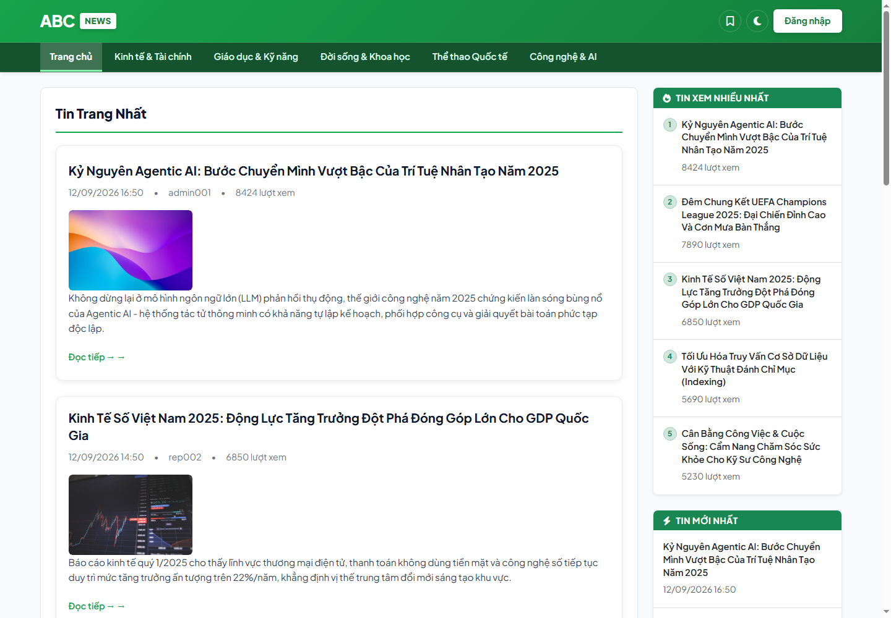 | 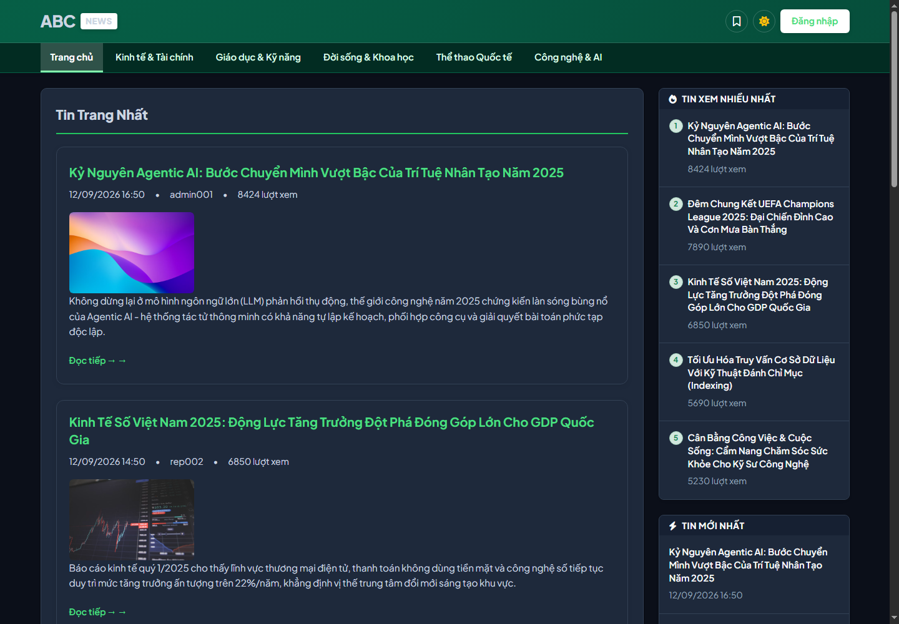 |

#### Chuyên mục tin tức và chi tiết bài viết
| Chuyên mục theo slug | Chi tiết bài viết và chia sẻ |
|:---:|:---:|
| 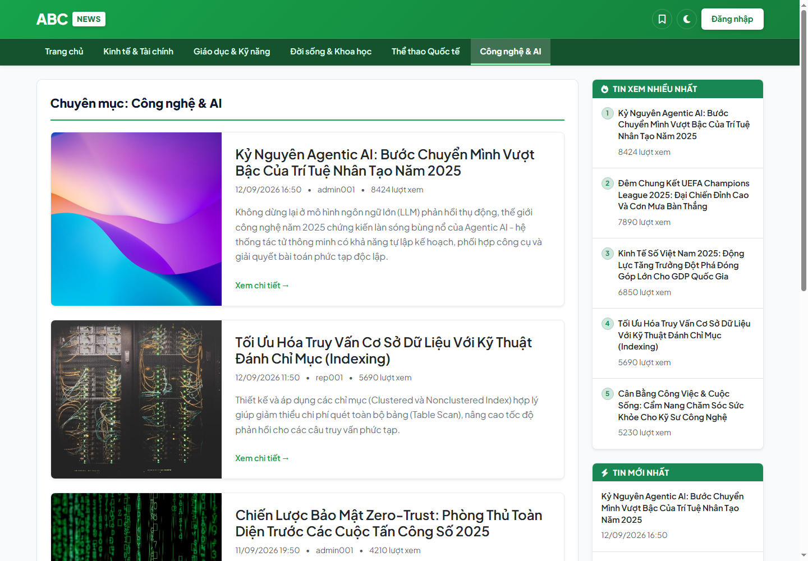 | 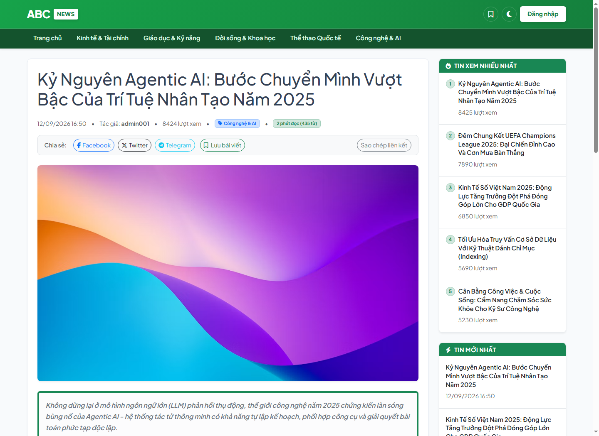 |

#### Đánh dấu đọc sau và bình luận độc giả
| Danh sách đọc sau trên Offcanvas | Khu vực gửi bình luận dưới bài viết |
|:---:|:---:|
| 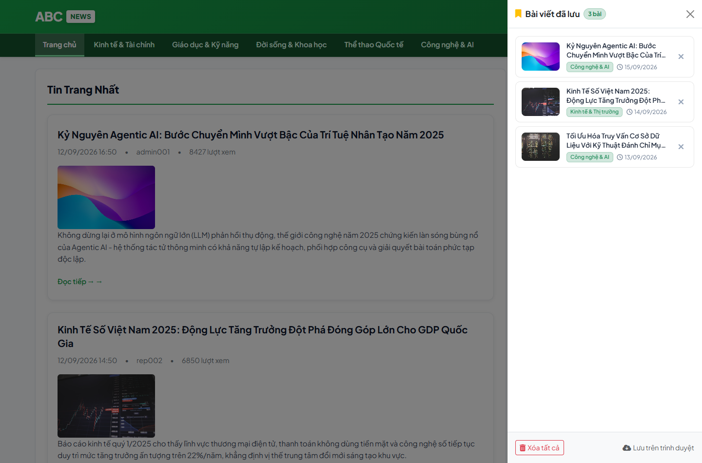 | 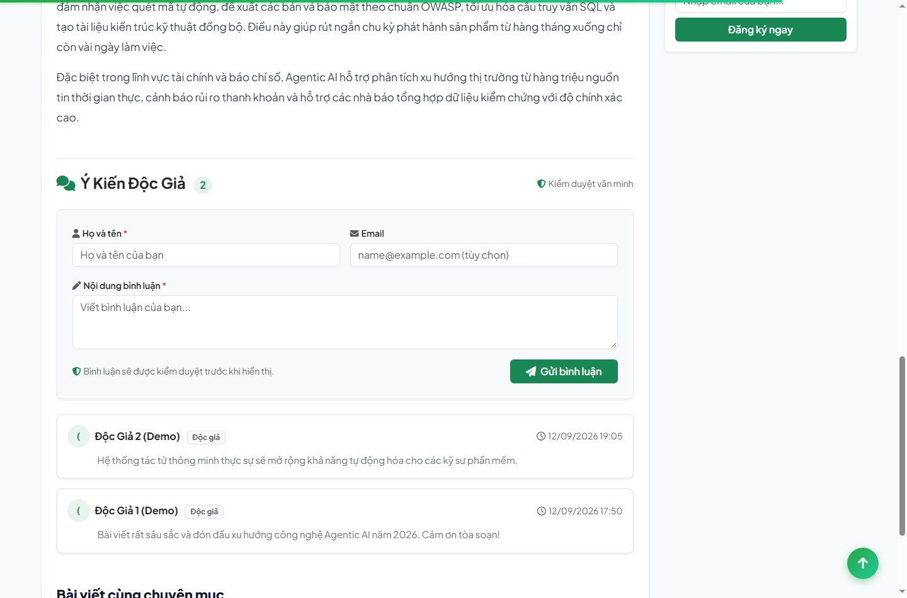 |

### Khu vực quản trị

#### Cổng đăng nhập và bảng điều khiển
| Trang đăng nhập hệ thống | Bảng điều khiển quản trị |
|:---:|:---:|
| 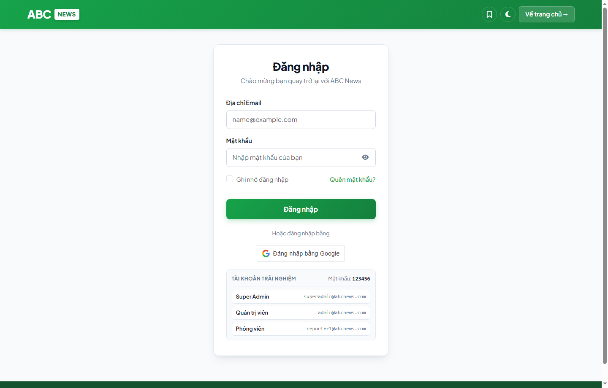 | 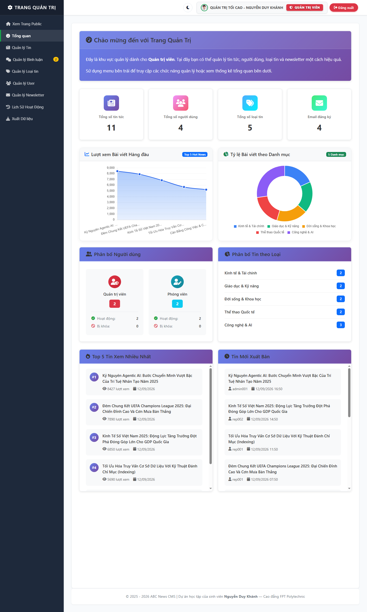 |

#### Quản lý bài viết và chuyên mục
| Quản lý bài viết và soạn thảo | Quản lý loại tin và slug |
|:---:|:---:|
| 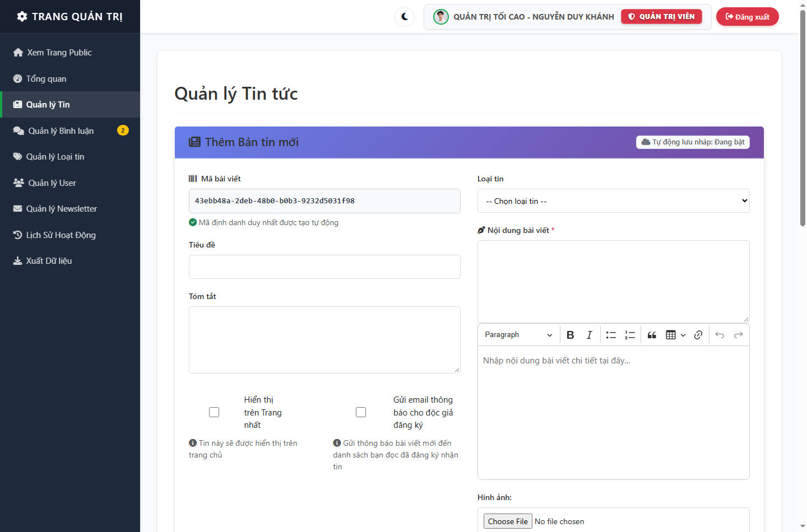 | 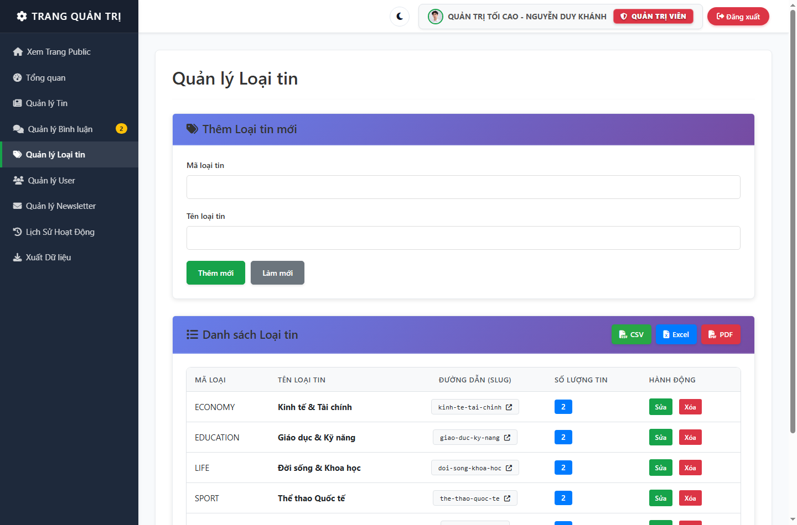 |

#### Quản lý người dùng và kiểm duyệt bình luận
| Quản lý người dùng và vai trò | Kiểm duyệt bình luận độc giả |
|:---:|:---:|
| 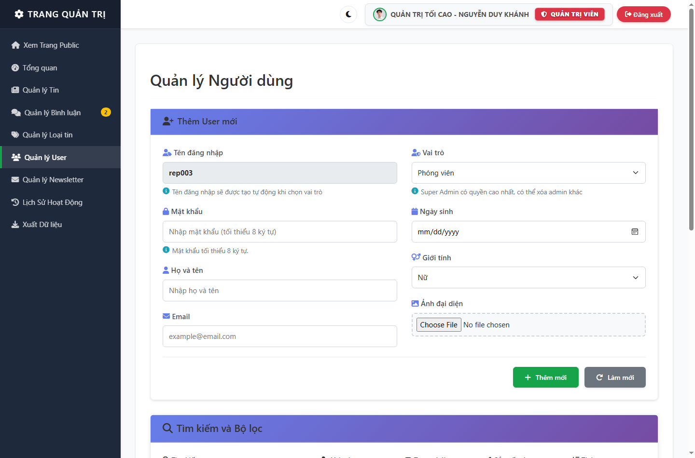 | 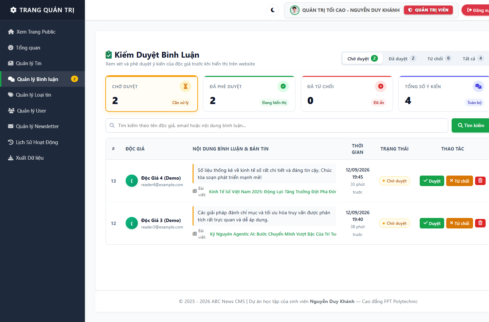 |

#### Hồ sơ quản trị viên
| Hồ sơ cá nhân và đổi mật khẩu |
|:---:|
| 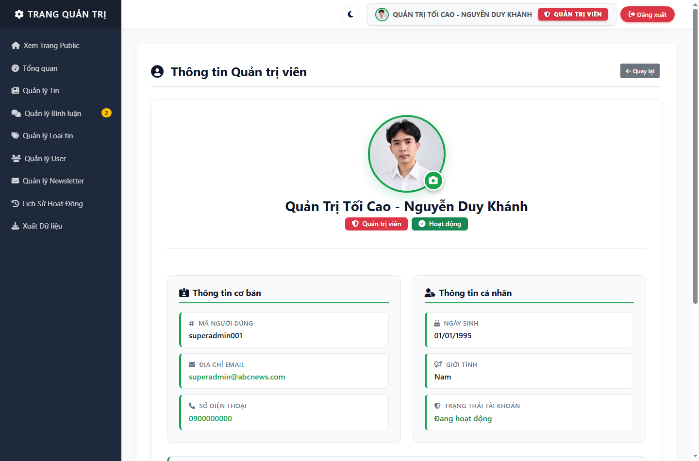 |

---

## Kiến trúc hệ thống

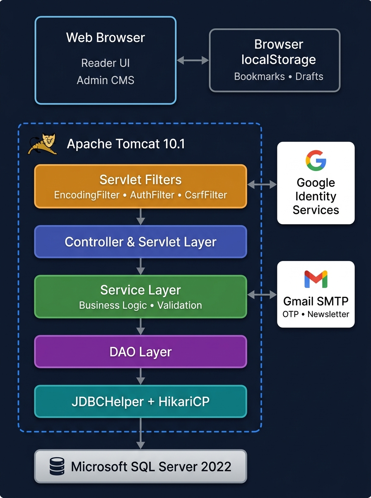
*Sơ đồ kiến trúc tổng thể của ABCNews từ tầng Client, Bộ lọc Servlet (Tomcat), Controller, Service, DAO, HikariCP đến SQL Server và các dịch vụ bên ngoài.*

Dự án tổ chức theo Layered MVC với Service layer cho các nghiệp vụ cốt lõi; một số thao tác đọc/tra cứu đơn giản vẫn có thể truy cập DAO trực tiếp:
- Controller Layer: Tiếp nhận yêu cầu HTTP, kiểm tra sơ bộ tham số, quản lý phiên làm việc và chuyển tiếp dữ liệu đến view JSP.
- Service Layer: Xử lý các quy tắc nghiệp vụ cốt lõi như xác thực, kiểm tra OTP, cấp phát và xoay vòng token Remember-Me, sinh slug duy nhất và kiểm tra quyền sở hữu nội dung.
- DAO Layer: Đóng gói câu truy vấn SQL và thao tác cơ sở dữ liệu qua PreparedStatement để hạn chế rủi ro SQL Injection.
- Cơ chế truy cập dữ liệu: JDBC kết hợp HikariCP là cơ chế truy cập dữ liệu chính. Hibernate ORM được sử dụng như thành phần hỗ trợ để định nghĩa thực thể Entity và kiểm tra cấu trúc schema.

---

## Cơ chế bảo mật

Các biện pháp bảo vệ trong dự án được xây dựng dựa trên nguyên tắc phòng thủ cơ bản:
- Băm mật khẩu: Mật khẩu người dùng được băm một chiều bằng thuật toán BCrypt trước khi lưu vào cơ sở dữ liệu.
- Thay đổi mật khẩu: Mật khẩu hiện tại được xác minh trước khi cập nhật mật khẩu mới; mật khẩu mới được lưu dưới dạng BCrypt hash.
- Token Remember-Me an toàn: Token ngẫu nhiên 256-bit được sinh qua SecureRandom. Cơ sở dữ liệu chỉ lưu bản băm SHA-256. Cookie trình duyệt sử dụng cờ HttpOnly và SameSite=Lax. Token được xoay vòng sau mỗi lần tự động đăng nhập thành công nhằm giảm thiểu rủi ro bị tấn công phát lại.
- Email OTP: Mã OTP 6 chữ số có hiệu lực trong 5 phút. Việc so khớp sử dụng thuật toán so sánh thời gian hằng số MessageDigest.isEqual để giảm thiểu nguy cơ timing attack, kết hợp giới hạn tối đa 3 lần nhập sai.
- Phân quyền vai trò và chặn leo thang đặc quyền: Vai trò Quản trị tối cao được xác định bằng trường IsSuperAdmin trong cơ sở dữ liệu. Quản trị viên thông thường không được phép sửa, khóa hoặc xóa tài khoản của Quản trị viên khác.
- Kiểm soát yêu cầu POST qua CsrfFilter: Các thao tác làm biến đổi dữ liệu trong khu vực quản trị được bảo vệ bởi bộ lọc CSRF, kiểm tra token từ tham số form `_csrf` hoặc header `X-CSRF-TOKEN`.
- Làm sạch nội dung chống XSS: Thư viện Jsoup với cấu hình thẻ an toàn được dùng để làm sạch nội dung bài viết và bình luận độc giả trước khi lưu trữ hoặc hiển thị.
- Kiểm tra tệp tải lên: Lớp SafeImageStorage kiểm tra phần mở rộng tệp, định dạng MIME và đổi tên tệp ngẫu nhiên bằng UUID trước khi lưu vào thư mục phân vùng.
- Ghi log máy chủ: Sử dụng java.util.logging.Logger để theo dõi các trường hợp lỗi và ngoại lệ trên máy chủ.

---

## Chuyên mục và định tuyến URL

Dự án triển khai cơ chế đường dẫn chuyên mục thân thiện cho độc giả:
- Quy tắc sinh slug: Chuyển đổi tên chuyên mục có dấu sang chuỗi không dấu, ví dụ `Công nghệ & AI` thành `cong-nghe-ai`, truy cập qua `/category/cong-nghe-ai`.
- Xử lý ký tự tiếng Việt: Tách dấu thanh Unicode, chuyển đổi ký tự đ và Đ thành d, thay thế khoảng trắng và ký tự đặc biệt bằng dấu gạch ngang.
- Giới hạn độ dài: Đảm bảo độ dài slug hoàn chỉnh không vượt quá 200 ký tự kể cả khi bổ sung hậu tố số xử lý trùng lặp.
- Tương thích ngược: Tự động chuyển hướng từ các liên kết cũ dạng `/category?id=TECH` sang URL slug mới.
- Liên kết cơ sở dữ liệu: Quan hệ giữa bài viết và chuyên mục vẫn sử dụng khóa ngoại CategoryId để đảm bảo tính toàn vẹn tham chiếu.
- Đường dẫn bài viết: Chi tiết bài viết hiện vẫn sử dụng định dạng `/detail?id={uuid}` do dự án chưa áp dụng slug cho bài viết.

---

## Cơ sở dữ liệu

- Hệ quản trị cơ sở dữ liệu: Microsoft SQL Server 2022
- Cơ chế kết nối: JDBC kết hợp Connection Pool HikariCP
- Các bảng chính trong hệ thống:
  - `Users`: Tài khoản người dùng, vai trò, trạng thái hoạt động và trường IsSuperAdmin.
  - `Categories`: Chuyên mục tin tức với mã Id, tên Name và chuỗi Slug duy nhất.
  - `News`: Nội dung bài viết, tiêu đề, tóm tắt, tác giả, chuyên mục, lượt xem và cờ trang nhất.
  - `Comments`: Bình luận độc giả cùng trạng thái kiểm duyệt Chờ duyệt, Đã duyệt hoặc Từ chối.
  - `OtpTokens`: Mã OTP xác thực, thời hạn, số lần thử và trạng thái tiêu thụ.
  - `RememberTokens`: Bản băm SHA-256 của token duy trì đăng nhập và thời hạn hiệu lực.
  - `ActivityLogs`: Nhật ký ghi nhận các thao tác nghiệp vụ quan trọng.
  - `Newsletters`: Danh sách email độc giả đăng ký nhận tin.
- Kịch bản cơ sở dữ liệu:
  - `schema/ABCNews.sql`: Khởi tạo cơ sở dữ liệu và cấu trúc bảng.
  - `schema/seed_data.sql`: Dữ liệu mẫu ban đầu chuẩn tiếng Việt UTF-8.
  - `schema/migrations/001_security_refactor.sql`: Bổ sung trường IsSuperAdmin và bảng RememberTokens.
  - `schema/migrations/002_category_slug.sql`: Bổ sung cột Slug và chỉ mục duy nhất cho chuyên mục.

---

## Cấu hình hệ thống

Hệ thống nạp cấu hình thông qua ConfigHelper theo thứ tự ưu tiên:
1. Biến môi trường hệ điều hành
2. System Properties
3. Tệp cấu hình `src/main/resources/app.properties`
4. Giá trị mặc định phục vụ môi trường phát triển cục bộ

Mẫu cấu hình tham khảo từ tệp `src/main/resources/app.properties.example`:

```properties
# Cơ sở dữ liệu SQL Server
db.host=localhost
db.port=1433
db.name=ABCNews
db.user=sa
db.password=your_database_password_here

# Cấu hình Gmail SMTP cho OTP và bản tin
mail.smtp.host=smtp.gmail.com
mail.smtp.port=587
mail.smtp.auth=true
mail.smtp.starttls.enable=true
mail.smtp.user=your_email@gmail.com
mail.smtp.password=your_gmail_app_password_here

# Cấu hình Google Identity Services
google.client.id=your_google_client_id_here

# Cấu hình Base URL ứng dụng cho Canonical URL
app.base.url=http://localhost:8088
```

---

## Hướng dẫn cài đặt và khởi chạy

### Khởi chạy bằng Docker Compose

Yêu cầu môi trường: Đã cài đặt Docker Desktop.

```bash
# 1. Clone mã nguồn dự án
git clone https://github.com/nkhanhduy/ABCNews.git
cd ABCNews

# 2. Tạo tệp cấu hình môi trường từ mẫu (.env.example)
cp .env.example .env

# 3. Khởi chạy toàn bộ hệ thống gồm Tomcat và SQL Server 2022
docker compose up --build -d

# 4. Kiểm tra trạng thái container
docker compose ps

# 5. Truy cập ứng dụng qua trình duyệt:
# - Trang chủ độc giả: http://localhost:8088/home
# - Trang đăng nhập:   http://localhost:8088/login
```

Dừng và hạ các dịch vụ:
```bash
docker compose down
```

### Khởi chạy cục bộ

Yêu cầu môi trường: JDK 17, Maven 3.8 trở lên, Microsoft SQL Server 2019 trở lên và Apache Tomcat 10.1.

Các bước thực hiện:
1. Tạo cơ sở dữ liệu và nạp dữ liệu mẫu vào SQL Server:
   - Cài đặt mới: Chạy lần lượt `schema/ABCNews.sql` (tạo bảng và khóa) rồi đến `schema/seed_data.sql` (nạp dữ liệu demo).
   - *Ghi chú: Thư mục `schema/migrations/` chỉ dùng khi nâng cấp từ các phiên bản cơ sở dữ liệu cũ hơn.*
2. Tạo tệp `src/main/resources/app.properties` từ tệp mẫu `app.properties.example` và cập nhật thông tin kết nối cơ sở dữ liệu.
3. Chạy kiểm thử tự động và đóng gói tệp WAR:
   ```bash
   mvn clean test
   mvn clean package -DskipTests
   ```
4. Sao chép tệp `target/ABCNews.war` vào thư mục `webapps` của Apache Tomcat 10.1 và khởi động máy chủ.

---

## Kiểm thử tự động

Dự án áp dụng kiểm thử tự động với JUnit 5 và Mockito cho các luồng nghiệp vụ và bảo mật cốt lõi:
- Xác thực và duy trì đăng nhập: Kiểm tra đăng nhập thành công, đăng nhập thất bại, tài khoản bị vô hiệu hóa, cấp phát token và xoay vòng token.
- Luồng Email OTP: Kiểm tra mã đúng, mã sai, vượt quá số lần thử, mã hết hạn và ngăn chặn sử dụng lại mã cũ.
- Phân quyền: Kiểm tra giới hạn của phóng viên đối với bài viết của người khác, chặn Admin thông thường thao tác trên Super Admin và chặn tự xóa tài khoản.
- Bộ lọc CSRF: Kiểm tra tự khởi tạo token cho GET, từ chối POST thiếu hoặc sai token với mã HTTP 403, chấp nhận token qua form parameter hoặc request header, và miễn trừ cho callback Google.
- Chuyên mục và slug: Kiểm tra chuyển đổi tiếng Việt, giải quyết xung đột slug và giới hạn độ dài không quá 200 ký tự.

Lệnh thực thi toàn bộ kiểm thử:
```bash
mvn clean test
```

Kết quả kiểm thử thực tế trên mã nguồn: **97/97 tests passed** không có lỗi và không có cảnh báo bỏ qua.

---

## Continuous Integration

Dự án thiết lập quy trình Continuous Integration tự động qua GitHub Actions tại `.github/workflows/maven.yml`:
- Kích hoạt tự động khi có sự kiện push hoặc pull request vào nhánh chính main.
- Khởi tạo môi trường Ubuntu với Eclipse Temurin JDK 17 và cache thư viện Maven.
- Chạy lệnh kiểm thử tự động `mvn -B clean test --file pom.xml` nhằm xác nhận mã nguồn luôn vượt qua bài kiểm thử trước khi tích hợp.

---

## Tài khoản trải nghiệm

Hệ thống có sẵn các tài khoản mẫu trong kịch bản `schema/seed_data.sql` để phục vụ trải nghiệm:

> [!NOTE]
> Các tài khoản này chỉ phục vụ môi trường demo và phát triển local.

| Vai trò | Email đăng nhập | Mật khẩu | Phạm vi quyền hạn |
|---|---|:---:|---|
| Quản trị tối cao | `superadmin@example.com` | `Demo@123456` | Toàn quyền hệ thống, quản trị tài khoản admin và phân bổ vai trò |
| Quản trị viên | `admin@example.com` | `Demo@123456` | Quản trị bài viết, chuyên mục, kiểm duyệt bình luận và quản lý phóng viên |
| Phóng viên | `reporter@example.com` | `Demo@123456` | Soạn thảo và quản lý bài viết do chính mình xuất bản |

Mật khẩu được băm bằng BCrypt trước khi lưu vào cơ sở dữ liệu.

---

## Những gì tôi đã thực hành

Thông qua việc xây dựng dự án cá nhân này, tôi đã thực hành các kiến thức:
- Thực hành vòng đời xử lý request của Jakarta Servlet và Filter.
- Tổ chức mã nguồn theo mô hình kiến trúc phân tầng MVC với tầng Service xử lý logic nghiệp vụ.
- Thao tác dữ liệu với JDBC thuần và tối ưu hóa kết nối qua Connection Pool HikariCP trên Microsoft SQL Server.
- Thực hành các giải pháp bảo mật web cơ bản như băm mật khẩu BCrypt, xoay vòng token Remember-Me, so khớp constant-time cho OTP, bộ lọc CSRF và làm sạch HTML qua Jsoup.
- Xây dựng kiểm thử tự động với JUnit 5 và Mockito để kiểm chứng các luồng nghiệp vụ.
- Đóng gói và chạy ứng dụng bằng Docker và Docker Compose.
- Thiết lập quy trình Continuous Integration cơ bản với GitHub Actions.

---

## Tác giả

- Họ và tên: Nguyễn Duy Khánh
- Vai trò: Sinh viên ngành Phát triển phần mềm — Cao đẳng FPT Polytechnic
- GitHub: [github.com/nkhanhduy](https://github.com/nkhanhduy)
- Email: [khanhndts02168@gmail.com](mailto:khanhndts02168@gmail.com)
- Năm thực hiện: 2025 - 2026
